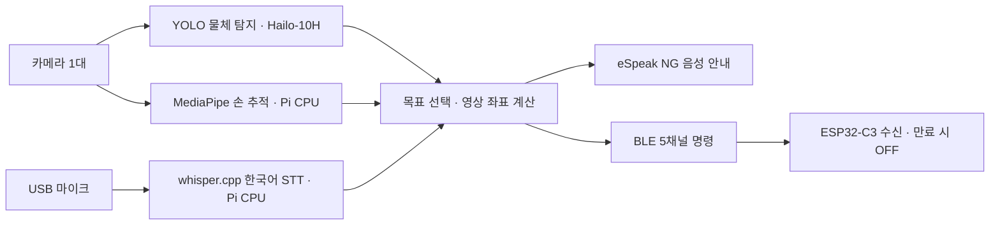

# Raspberry Pi 온디바이스 햅틱 MVP

카메라 한 대에서 물체와 손을 인식하고, 한국어로 선택한 목표까지의 영상상 방향·근접도를 ESP32-C3에 전달합니다. 패키지·모델을 처음 설치한 뒤에는 실행 중 클라우드 API를 사용하지 않습니다.

**구현과 호스트 시뮬레이션 검증을 마친 초기 버전입니다. 실제 Pi의 카메라·AI HAT+ 2·마이크·스피커 통합 성능은 부품을 받은 뒤 확인해야 합니다.** 모델 다운로드와 아래 설치 과정은 별도로 필요합니다.

## 동작 흐름



- 목표를 선택하기 전에는 안정적으로 보이는 물체 목록을 약 5초 간격으로 읽습니다. 말하는 중에는 다음 안내를 미룹니다.
- 초기 물체는 **컵, 물병, 휴대폰, 책, 마우스**입니다. 기존 COCO 사전학습 모델을 사용하므로 책상 사진을 별도로 학습하지 않습니다.
- “컵 찾아줘”라고 말하면 선택을 확인하고 안내합니다. 같은 종류가 여러 개면 “왼쪽” 또는 “오른쪽”으로 선택합니다.
- 손이 사라지면 출력이 멈추고, 같은 목표가 유지된 채 손이 돌아오면 다시 안내합니다. 목표 자체를 놓치거나 영상이 오래되면 **다시 선택해야 합니다**.
- “정지”로 안내를 멈추고 “목록”으로 주변 안내로 돌아갑니다. 터미널에서는 같은 명령과 `quit`, `Ctrl+C`를 사용합니다.
- TTS 중에는 마이크 입력을 버리므로 안내 중 음성 끼어들기는 지원하지 않습니다. 이때도 키보드 정지/종료는 가능합니다.

위치는 영상 평면의 좌표입니다. **실제 cm 거리, 깊이, 손이 물체를 잡았는지는 측정하지 않습니다.** 단순 IoU 추적이므로 동일 물체가 겹치거나 가려질 때 완전한 신원 유지는 보장하지 않으며, 모호하면 선택을 해제하고 다시 요청합니다.

## 1. 부품 없이 지금 실행

Python 3.10 이상이면 시뮬레이션은 추가 패키지 없이 실행됩니다. 아래 명령은 Pi 경로이며 PC에서도 `Raspi5_vision` 폴더에서 동일한 Python 명령을 사용합니다.

```bash
cd ~/Desktop/kimGA_raspi/microprocessor-capstone-design/"03. 김가네 캡스톤 디자인/Raspi5_vision"
python3 -m haptic_mvp simulate --report reports/simulation.json
```

6개 시나리오가 모두 `PASS`여야 합니다. 가상 물체/손 좌표와 명령 문장을 컨트롤러 → 실제 패킷 인코더 → 수신기 모델에 통과시킵니다. YOLO 인식률이나 STT 성능, 실제 BLE 지연을 측정하는 시험은 아닙니다.

## 2. Pi와 모델 준비

**이 프로젝트는 AI HAT+ 2 사용이 확정되어 있습니다.** HAT 배송 전에는 앞의 가상 입력 시뮬레이션으로 흐름을 확인하고, 환경·모델을 미리 준비합니다. 이 준비 과정에 CPU용 YOLO 설치는 필요하지 않습니다. `config/cpu.json`과 별도 CPU 실행 안내는 선택적인 대체 경로이며 기본 실행 절차에 포함하지 않습니다.

기준 환경은 **Pi 5 + Raspberry Pi OS Trixie 64-bit + AI HAT+ 2(Hailo-10H)**입니다. 현재 설치된 OS는 아직 확인하지 않았으므로 먼저 `cat /etc/os-release`, `uname -m`, `python3 --version`으로 확인합니다.

1. [카메라·AI HAT 준비](VISION_SETUP.md)를 따라 Hailo-10H 드라이버, 카메라 패키지, 가상환경, YOLO HEF와 손 추적 모델을 준비합니다.
2. [마이크·스피커 준비](AUDIO_SETUP.md)를 따라 Whisper와 다국어 `tiny` 모델을 설치하고 녹음·재생을 각각 확인합니다.
3. 설치 후 아래 점검을 실행합니다.

```bash
source .venv/bin/activate
python -m haptic_mvp doctor --deep --ble
```

`doctor`는 파일·패키지·명령 존재 여부를 확인합니다. `--deep`은 각 SDK를 별도 프로세스에서 import하고 필요한 API를 확인하여 ABI/설치 오류를 찾습니다. 카메라를 열거나 HAT 모델을 실행하거나 BLE에 연결하지 않으므로, 성공해도 실제 장치 시험은 아래 순서대로 진행합니다.

실행 구성과 기본 모델 위치:

| 항목 | 기본값 |
|---|---|
| 카메라 | Picamera2, 640×480, 요청 15 FPS |
| 물체 탐지 | `models/yolov8n_hailo10h.hef`, Hailo-10H용 |
| 라벨 | 저장소에 포함된 `models/coco.txt` |
| 손 추적 | `models/hand_landmarker.task`, 오른손 |
| STT | `~/Desktop/kimGA_raspi/whisper.cpp/build/bin/whisper-cli` |
| STT 모델 | `models/ggml-tiny.bin`, 다국어 |
| TTS | `espeak-ng`, 한국어 `ko`, `aplay` 재생 |
| BLE | 기본 로그만 출력, `--ble`로 실제 전송 |

15 FPS는 카메라 요청값이며 추론 처리량 보장이 아닙니다. AI HAT는 YOLO에 사용하고 손 추적·STT·TTS는 Pi CPU를 사용합니다. Whisper는 명령마다 모델을 읽는 초기 구조이므로 실제 지연을 측정해 모델·스레드 수를 조정합니다.

## 3. 카메라부터 단계별 실행

먼저 음성과 BLE를 빼고 카메라·HAT·손 추적을 확인합니다. USB 마이크가 아직 없어도 가능합니다.

```bash
python -m haptic_mvp doctor --deep --console
python -m haptic_mvp run --console
```

카메라에 컵과 오른손을 보여주고 터미널에서 `컵 찾아줘`를 입력합니다. 출력의 `state`, `direction`, `proximity`, `levels`를 확인합니다. `정지` 또는 `quit`로 멈춥니다. 마이크·스피커까지 준비되면 다음을 실행합니다.

```bash
python -m haptic_mvp run
```

이 단계에서는 BLE를 보내지 않고 결과만 기록합니다. 실행 시작 시 `BLE=LOG ONLY`라고 표시됩니다.

## 4. ESP32를 연결해 LED로 확인

기존 `ble_led_control.ino` 대신 [새 haptic_receiver 스케치](../esp32_device/firmware/haptic_receiver/README.md)를 ESP32에 올립니다. Arduino IDE의 `ESP32C3 Dev Module`, `USB CDC On Boot: Enabled`, `NimBLE-Arduino 2.5.1`을 사용합니다.

새 펌웨어는 **`DRY_RUN = true`**가 기본이므로 모터 GPIO를 구동하지 않습니다. 5개 명령 값을 시리얼에 출력하고, 하나라도 0보다 크면 내장 LED를 켭니다. 장치 이름과 UUID가 바뀌므로 예전 `led_control.py`와 호환되지 않습니다.

```bash
python -m haptic_mvp run --console --ble
# 카메라·명령·LED가 확인되면 음성도 사용
python -m haptic_mvp run --ble
```

연결 직후와 재연결 때는 목표를 다시 선택합니다. 기본 송신 간격은 100ms이고 명령 TTL은 500ms입니다. 연결·송신이 멈추면 ESP32의 수신 만료 검사로 출력이 꺼집니다. 100ms는 목표 송신 간격이며 실제 무선 지연 보장은 아닙니다.

현재 임시 매핑은 왼쪽→엄지, 오른쪽→검지, 앞→중지, 뒤→약지, 가까움→소지입니다. 사용자가 방향을 이해할 수 있는지 먼저 확인하고 PCB·손가락 역할을 확정한 뒤 수정합니다. 실제 모터 전원·드라이버·핀 연결 확인 전에는 수신기의 `DRY_RUN`을 유지합니다.

## 설정 변경

공통 기본값은 `config/mvp.json`에 있습니다. 장치별 차이는 Git에서 제외되는 `config/local.json`에 필요한 항목만 적습니다.

```json
{
  "vision": {"hand": "Left", "show_preview": false},
  "audio": {"input_device": null, "output_device": null},
  "controller": {"announce_interval_s": 8, "rotation_deg": 0},
  "ble": {"address": null}
}
```

```bash
python -m haptic_mvp doctor --deep --ble --config config/local.json
python -m haptic_mvp run --ble --config config/local.json
```

모델 상대 경로는 이 `Raspi5_vision` 폴더 기준입니다. 마이크 번호와 ALSA 출력 장치는 [음성 준비 문서](AUDIO_SETUP.md)에서 확인합니다. 화면을 보려면 Pi 데스크톱에서 `show_preview: true`를 사용하고, SSH 환경에서는 false를 유지합니다. 키보드 명령 입력에는 대화형 터미널이 필요합니다.

`controller.rotation_deg`와 `flip_x`는 카메라 기준 방향을 사용자 기준 방향에 맞춥니다. 해상도를 바꾸면 `controller.image_aspect`도 `width/height`와 같아야 합니다. 기본 프레임 만료는 0.5초이며, 오래된 결과로 모터를 계속 구동하지 않습니다.

## 코드와 검사

| 경로 | 역할 |
|---|---|
| `haptic_mvp/vision.py` | 카메라 최신 프레임, Hailo/YOLO, MediaPipe |
| `haptic_mvp/audio.py` | 발화 추출, 로컬 STT, TTS, 에코 차단 |
| `haptic_mvp/controller.py` | 목표 선택·추적, 방향·근접도, 상태 전환 |
| `haptic_mvp/runtime.py` | 영상·음성·BLE 병행 실행, 오류·종료 처리 |
| `haptic_mvp/ble_link.py`, `protocol.py` | BLE 연결·재연결, 5채널 패킷 |
| `haptic_mvp/simulation.py`, `tests/` | 가상 입력·고장 상황 시험 |

개발 검사:

```bash
python -m pip install -r requirements-dev.txt
python -m pytest -q
python -m ruff check haptic_mvp tests
python -m mypy haptic_mvp
python -m haptic_mvp simulate --report reports/simulation.json
```

영상 어댑터 시험 일부는 NumPy를 사용합니다. PC에서 별도 환경을 만들면 NumPy도 설치합니다. 실제 Raspberry Pi OS/Hailo/카메라 SDK는 해당 부품을 연결한 Pi에서 검사합니다.

[9월 18일 설계](../docs/2026-09-18_Raspberry_Pi_온디바이스_MVP_설계.md) · [9월 19일 구현·검증 기록](../docs/2026-09-19_Raspberry_Pi_MVP_구현_검증.md) · [기존 BLE LED 시험](../docs/2026-09-17_BLE_LED_무선_통신_시험.md)
