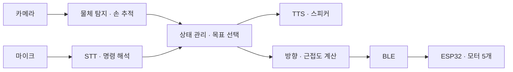

# Raspberry Pi 온디바이스 MVP 설계

- 작성일: 2026-09-18 (한국 시간)
- 프로젝트: 김가네 비전 기반 햅틱 글러브
- 목적: 카메라·오디오 부품 도착 후 구현할 Raspberry Pi 프로그램의 범위와 구조 정리
- 상태: **구현 전 설계안**. 아래 모듈·음성 기능·5채널 프로토콜은 아직 구현하지 않음
- 선행 결과: [BLE LED 시험](2026-09-17_BLE_LED_무선_통신_시험.md)에서 Pi → ESP32 명령 송수신, 실제 LED ON/OFF, 종료 후 재연결 확인

## 1. 사용자 방향과 이번 설계의 제안

### 사용자가 제시한 방향

- Raspberry Pi를 최종 처리 장치로 사용하고 AI HAT+ 2도 장착한다.
- 카메라는 1대를 사용한다. Wide/Standard 중 실제 모델은 아직 미정이다.
- 마이크로 사용자의 요청을 받고 스피커로 안내한다. 마이크 추가를 검토 중이며 실제 오디오 부품은 아직 확정하지 않았다.
- 보이는 물체를 약 5초 간격으로 안내하고, 사용자가 물체를 말하면 STT로 받아 탐색 대상으로 선택한다.
- 선택한 대상을 TTS로 확인한 뒤 물체와 손의 상대 위치를 계산해 ESP32로 전달한다.
- 장갑은 손가락별 모터 1개, 총 5개를 사용한다.
- 온디바이스 동작을 선호한다. 인터넷 사용을 절대 금지하는 요구는 아니지만, 기본 동작 경로는 로컬 처리로 설계한다.

### 이번 문서의 권장 MVP 범위

- 책상 위 고정 카메라, 사용자 한 명과 안내할 손 하나를 기준으로 시작한다.
- 사전 학습된 모델이 지원하는 물체 3~5종을 대상으로 하고, 첫 시연에서는 종류별 하나씩 배치한다.
- 물체 탐지는 YOLO, 손 추적은 MediaPipe를 후보로 삼는다. 정확한 모델과 실행 버전은 장비에서 검증 후 고정한다.
- 첫 거리 표현은 **영상상의 상대 방향과 근접도**로 정의한다.
- 음성 명령은 물체 선택, 정지, 다시 안내처럼 제한된 명령부터 처리한다.
- 손·목표 분실, 오래된 영상, 통신 중단 시 진동을 중지하도록 구현한다.

이 항목들은 구현을 위한 제안이며, 장비 성능이나 최종 사용성 검증을 완료했다는 의미는 아니다. 카메라·음성·모터가 통합된 상태의 시험은 아직 진행하지 않았다.

## 2. 사용자 흐름과 상태 관리

목표 흐름은 **주변 물체 안내 → 음성 요청 → 대상 확인 → 손 이동 안내 → 중지 또는 탐색 종료**다. 여기서 포커싱은 카메라의 광학 초점 조절이 아니라 안내할 목표 물체를 선택하고 추적한다는 뜻이다.

| 상태 | 입력과 판단 | 출력 및 전환 |
| --- | --- | --- |
| 주변 탐색 | 영상에서 대상 물체들을 지속적으로 검출 | 안정적으로 보이는 물체를 짧게 안내 |
| 음성 요청 수신 | 사용자가 “컵 찾아줘”처럼 발화 | STT 결과를 대상 클래스와 연결 |
| 대상 확인 | 해당 물체의 현재 검출 여부와 후보 수 확인 | 한 개면 “컵을 찾아 안내하겠습니다”, 없으면 “현재 컵이 보이지 않습니다” |
| 손 안내 | 선택한 목표와 손의 유효한 위치 비교 | 방향·근접도에 따른 BLE 명령 전송 |
| 일시 중단 | 손·목표 분실 또는 영상이 오래됨 | 진동 정지, 사유 안내, 유효한 상태 재확인 |
| 종료 | 사용자의 정지 명령 또는 프로그램 종료 | 모터 OFF, 목표 선택 해제 |

### 안내 주기

- **5초는 음성 안내 간격이며 영상 처리 주기가 아니다.** 영상은 가능한 일정 속도로 계속 처리한다.
- 첫 설정값은 5초로 두고 변경 가능하게 만든다.
- 사용자가 말하는 중이거나 이전 음성이 재생 중이면 주기 안내를 건너뛴다. 안내 문장을 계속 대기열에 쌓지 않는다.
- 목표 선택 후에는 주변 물체 목록을 멈추고 해당 목표의 상태 변화에 집중한다.
- 손이나 물체가 보이지 않는다는 동일 안내는 매 프레임 반복하지 않는다.
- 순간적인 오검출이 안내로 이어지지 않도록 검출의 신뢰도와 시간상 지속성을 함께 확인한다. 임계값은 실측 후 조정한다.

### 대상 선택과 추적

“컵”이라는 클래스 선택 이후에는 하나의 물체를 목표로 유지한다. 프레임마다 가장 확률이 높은 컵으로 갈아타지 않는다. 같은 종류가 여러 개면 “왼쪽 컵인가요?”처럼 추가 선택을 받는 기능으로 확장한다.

물체가 가려졌다 다시 나타났다고 같은 물체임을 무조건 보장할 수는 없다. 추적 ID가 바뀌거나 재식별이 불확실하면 안내를 멈추고 대상을 재확인한다. 지원하지 않는 물체명이나 불분명한 음성은 임의의 목표로 연결하지 않는다.

## 3. 물체 인식과 데이터셋 전략

### 사전 학습 모델로 시작

처음에는 COCO 등으로 이미 학습된 YOLO를 불러와 추론한다. 별도의 책상 데이터 학습을 먼저 수행할 필요는 없다. COCO 기본 클래스의 컵(`cup`), 물병(`bottle`), 휴대전화(`cell phone`), 책(`book`), 마우스(`mouse`) 등을 초기 후보로 삼고 실제 영상에서 성능을 확인해 3~5종을 선정한다.

펜·열쇠·지우개·안경 등은 COCO 기본 클래스에 없으므로 같은 모델로 바로 탐지된다고 가정하지 않는다. 필요한 경우 해당 물체를 지원하는 모델이나 별도 라벨링·추가 학습을 검토한다. 한국어 명칭은 검출 클래스와 별도 사전으로 관리한다.

### 실제 책상은 먼저 평가 장소로 사용

| 평가 조건 | 확인할 것 |
| --- | --- |
| 물체 위치·회전 변화 | 특정 위치나 방향에서만 검출되는지 |
| 낮·밤·역광 | 조명에 따라 누락 또는 오검출이 늘어나는지 |
| 손에 의한 가림 | 물체 추적이 끊기거나 다른 물체로 바뀌는지 |
| 같은 종류의 물체 2개 | 선택한 목표가 유지되는지 |
| 맨손·실제 장갑 | MediaPipe가 관절과 손 방향을 계속 잡는지 |

반복되는 실패 조건이 확인되면 그때 해당 영상을 수집하고 라벨링해 미세조정을 검토한다. 추가 학습을 진행할 경우 학습·평가 자료는 촬영 세션 등을 기준으로 분리해 거의 같은 연속 프레임이 양쪽에 들어가지 않게 한다. 대상 종류와 실패 원인을 먼저 좁힌 뒤 데이터셋 규모를 정한다.

## 4. 손과 물체의 방향·근접도

### 첫 MVP에서 계산할 값

- 손 기준점: 손목과 손가락 뿌리 관절들의 평균 등으로 정의한 손바닥 대표점
- 목표 기준점: 선택한 물체 검출 상자의 중심
- 방향: 손 기준점에서 목표 기준점으로 향하는 영상상의 벡터
- 근접도: 손 기준점과 목표 검출 영역 사이의 영상 거리 등을 이용한 멂·중간·가까움 분류

물체 탐지와 손 추적 결과는 **동일한 영상 좌표계**로 변환해야 한다. 모델마다 입력 크기, 여백, 잘라낸 영역이 다르면 원본 좌표로 되돌린 뒤 비교한다. 프레임 번호와 촬영 시각도 전달해 시간 차이가 큰 결과를 조합하지 않는다.

카메라 화면의 좌·우·위·아래를 사용자의 좌·우·앞·뒤와 맞춰 보정한다. 손 회전에 따른 손가락별 진동 매핑은 별도 문제이므로 첫 단계는 손 자세를 제한해 시험한다. 이후 손 관절 방향 또는 MPU-6050 정보를 사용하는 방법을 비교한다. 모터 5개에 어떤 방향과 패턴을 배정할지는 아직 확정하지 않았다.

### 실제 거리와의 구분

MediaPipe의 정규화 좌표와 손 기준 깊이, 손 중심을 원점으로 하는 world 좌표를 YOLO의 영상 좌표와 바로 빼서 실제 거리(cm)를 구할 수는 없다. 단일 RGB 카메라의 첫 결과는 **2D 상대 방향·근접도**이며 정확한 3D 거리로 표시하지 않는다.

책상 위 기준점과 실제 크기로 평면 보정을 하면 해당 평면상의 거리 추정으로 확장할 수 있다. 다만 공중에 있는 손이나 높이가 있는 물체에는 평면 가정에 따른 오차가 생긴다. 검출 상자가 겹치는 것도 실제 접촉이나 물체를 잡았다는 증거는 아니다. 초기 음성 표현은 “목표 가까이 도달했습니다” 같은 근접 안내 후보로 두고 실제 동작으로 검증한다.

## 5. 로컬 음성 입출력

첫 하드웨어 후보는 USB 마이크와 유선 스피커다. 정확한 제품과 오디오 장치 번호는 부품 도착 후 결정한다.

| 기능 | 초기 구현 제안 | 확인할 항목 |
| --- | --- | --- |
| 발화 감지 | 말이 시작하고 끝나는 구간을 감지해 STT 입력 생성 | 주변 소음, 짧은 물체명, 무음 오인식 |
| STT | whisper.cpp 다국어 `tiny` 또는 `base`부터 비교 | 한국어 정확도, 응답 시간, 영상 처리 중 부하 |
| 명령 해석 | `컵/머그컵 → cup`, `휴대폰/스마트폰 → cell phone` 등 사전 사용 | 조사·표현 차이, 미지원 명령, 정지 명령 |
| TTS | 한국어 로컬 엔진, 반복 안내 문장 캐시 | 알아듣기 쉬운 발음, 합성 시간, 재생 장치 |

whisper.cpp는 Raspberry Pi에서 로컬 실행 가능한 후보다. 한국어에는 영어 전용 `.en` 모델을 선택하지 않는다. 모델은 초기 설치 때 내려받아 로컬에 보관하고, 추론은 Pi에서 수행하는 방향이다.

TTS의 기능 검증 후보는 한국어를 지원하는 eSpeak NG다. 한국어 발음의 자연스러움은 장비에서 별도로 평가하고 엔진을 확정한다. “컵을 안내하겠습니다” 같은 고정 문장은 미리 합성한 음성 파일을 재사용해 반복 합성을 줄일 수 있다. 미리 만든 음성을 재생하는 것과 실행 때마다 TTS를 합성하는 것은 구현에서 구분한다.

### 스피커 안내의 재인식 방지

스피커에서 나온 말을 마이크가 다시 명령으로 받아들이지 않도록 한다. 첫 버전은 TTS 재생 중 STT 입력을 차단하고, 재생 중 수집된 음성을 폐기한 뒤 듣기를 재개하는 방식으로 시험한다. 잔향도 함께 확인한다.

이 방식에서는 TTS 재생 중 사용자의 음성 요청과 음성 정지 명령도 받을 수 없다. 안내 문장을 짧게 하고, 프로그램 종료나 별도 정지 입력은 계속 처리한다. 안내 도중 음성으로 끼어드는 기능은 반향 제거 등 추가 처리가 필요한 후속 항목이다. TTS 재생 때문에 영상 처리나 BLE 루프가 멈추게 해서는 안 된다.

## 6. 장치별 역할과 AI HAT+ 2

| 장치 | 초기 역할 |
| --- | --- |
| Raspberry Pi AI HAT+ 2 | Hailo-10H에서 지원되는 YOLO 모델로 물체 탐지 |
| Raspberry Pi 5 CPU | 손 추적, 음성 처리, 상태·목표 관리, 방향 계산, BLE |
| ESP32-C3 | 명령 수신, 모터별 PWM, 명령 만료 시 정지 |

AI HAT+ 2는 모든 Python 모델을 자동으로 가속하는 장치로 취급하지 않는다. 드라이버·런타임과 지원 모델을 설치하고, Hailo-10H용으로 제공되는 모델부터 검증한다. YOLO 버전과 모델 크기는 지원 여부와 실제 성능을 보고 선택한다. MediaPipe가 HAT에서 바로 실행된다고 가정하지 않는다.

Hailo에는 Whisper 음성 인식 예제도 있으므로 STT 가속은 후속 후보로 둔다. 먼저 물체 탐지를 안정화한 뒤 같은 NPU에서 음성까지 실행했을 때 지원 여부, 자원 사용과 영상 지연을 확인한다. 한국어 명령 정확도와 모델 동시 실행 성능은 아직 측정하지 않았다.

Pi OS, Python, ARM용 패키지와 Hailo 런타임의 호환 조합은 구현 시작 때 확인하고 버전을 고정한다. 기존 BLE 가상환경에 영상·음성 의존성을 무조건 추가하기보다 호환되는 환경 구성을 먼저 검증한다.

## 7. 프로그램 구조 제안

현재 [Raspi5_vision](../Raspi5_vision/) 아래에 다음 책임을 분리하는 방향이다. 아래 이름은 제안이며 아직 생성된 모듈이 아니다. 기존 `ble_led_control` 시험은 동작 기준으로 보관한다.

| 모듈 | 책임 |
| --- | --- |
| `main` | 설정 읽기, 작업 시작과 종료, 전체 상태 확인 |
| `camera` | 실제 카메라 또는 저장 영상 입력, 프레임·촬영 시각 제공 |
| `object_detector` | 물체 클래스·영역·신뢰도 추출, 실행 엔진 교체 지점 |
| `hand_tracker` | 손 관절·대표점·방향 추출 |
| `audio` | 녹음, 발화 감지, STT, TTS 재생 관리 |
| `controller` | 상태 전환, 물체명 해석, 목표 선택과 유지 |
| `guidance` | 유효한 위치 정보로 방향·근접도와 진동 패턴 계산 |
| `ble_link` | 연결·재연결, 최신 명령 전달과 상태 수신 |
| `config` | 지원 물체, 안내 주기, 임계값, 모델·입출력 장치 설정 |

### 실행 원칙

- 영상 추론, 음성 처리, BLE를 독립된 작업으로 나누고 결과를 전달한다. 무거운 추론이 통신 작업을 막으면 별도 프로세스로 분리한다.
- 영상은 오래된 프레임을 계속 쌓지 않고 최신 프레임을 우선 처리한다.
- 추론 결과에는 촬영 시각, 대상 식별 정보, 신뢰도와 유효 여부를 포함한다.
- STT나 TTS 처리 중에도 영상과 BLE 동작을 유지한다.
- 안내 주기, 영상 처리 주기, BLE 전송 주기를 분리한다. 특정 FPS나 지연을 구현 전에 보장하지 않는다.
- 카메라는 저장 영상으로, 음성 명령은 키보드 입력으로 대체할 수 있도록 해서 부품 없이도 상태 전환을 시험한다.

## 8. BLE와 5개 모터 명령

현재 검증한 BLE 코드는 LED용 ASCII `0`/`1` 명령이다. 아래 5채널 방식은 Pi와 ESP32 양쪽에 새로 구현해야 한다.

| 필드 후보 | 목적 |
| --- | --- |
| 명령 번호 | 오래되거나 순서가 뒤바뀐 명령 식별 |
| 손가락별 세기 5개 | TH·IN·MI·RI·PI 채널 제어, 범위는 프로토콜 구현 때 확정 |
| 유효시간 | ESP32가 새 명령 없이 계속 진동하지 않도록 제한 |
| 정지 상태 | 사용자 중지·분실·종료 시 전체 OFF 전달 |

Pi는 오래된 영상으로 새 진동 명령을 만들지 않고, 미전송 명령이 쌓이면 최신 상태를 우선한다. ESP32는 자신의 시간 기준으로 마지막 정상 명령 수신 이후의 경과를 감시한다. 명령 번호만으로 전달 지연을 모두 검출할 수 있다고 가정하지 않는다.

손·목표 분실 시 Pi가 정지를 보내고, BLE 자체가 끊기거나 새 명령이 없을 때는 ESP32가 유효시간에 따라 정지하는 두 경로를 둔다. 허용 영상 나이와 명령 유효시간은 수백 ms 범위 등을 후보로 실제 갱신 주기·지연에 맞춰 정한다.

첫 5채널 시험은 모터 대신 ESP32 시리얼에 수신값을 출력한다. 실제 모터는 전원·드라이버·보호 회로를 갖춘 뒤 연결한다.

## 9. 구현 순서와 확인 기준

| 단계 | 구현 및 시험 | 완료 판단 |
| --- | --- | --- |
| 1. 실행 틀 | 설정, 상태 관리, 저장 영상·키보드 대체 입력 | 부품 없이 요청→선택→중지 흐름 재현 |
| 2. 물체·손 추적 | 카메라, YOLO, MediaPipe와 위치 화면 표시 | 대상 3~5종 및 장갑 착용 손의 인식 상태 확인 |
| 3. 목표 안내·BLE | 목표 유지, 방향·근접도 계산, 5채널 수신 로그 | 선택 대상이 유지되고 분실·중지·명령 만료 시 OFF |
| 4. 음성 연결 | 발화 감지, 한국어 STT·명령 해석·TTS | 말로 목표 선택, 확인 안내, 스피커 음성의 재명령 방지 |
| 5. 통합 시험 | 카메라·음성·BLE·실제 모터 | 목표별 탐색 성공률, 소요 시간, 방향 안내와 종료 동작 기록 |

단계별로 검출 정확도·추적 유지율, 음성 명령 성공률, 촬영부터 명령 전송까지의 지연, 명령 만료에 따른 정지 동작, CPU·메모리·온도를 확인한다. 합격 기준의 수치는 초기 장비 측정 후 정한다. 기존 LED 시험의 쓰기+읽기 왕복 시간을 전체 시스템의 실시간 성능으로 대체하지 않는다.

## 10. 다음 구현 전에 결정·확인할 항목

1. 카메라 모델, 책상 위 설치 높이와 촬영 범위
2. 초기 대상 물체 3~5종과 각 물체의 한국어 명칭
3. 마이크·스피커 모델 및 로컬 한국어 TTS의 명료도
4. 실제 장갑 착용 시 손 추적 성능과 허용할 손 자세
5. Hailo-10H 지원 모델, Pi OS·Python·패키지 버전 조합
6. 방향을 손가락 5개에 대응시키는 패턴과 근접도 표현
7. 안내 간격, 대상 분실 처리, 영상·명령 만료 기준의 실측 조정

## 참고 자료

- [Ultralytics COCO 클래스 정의](https://github.com/ultralytics/ultralytics/blob/main/ultralytics/cfg/datasets/coco.yaml)
- [Ultralytics 물체 탐지](https://docs.ultralytics.com/tasks/detect/)
- [Ultralytics 물체 추적](https://docs.ultralytics.com/modes/track/)
- [MediaPipe Hand Landmarker 좌표와 처리 방식](https://ai.google.dev/edge/mediapipe/solutions/vision/hand_landmarker/python)
- [OpenCV 평면 호모그래피](https://docs.opencv.org/4.x/d9/dab/tutorial_homography.html)
- [whisper.cpp](https://github.com/ggml-org/whisper.cpp)
- [eSpeak NG 지원 언어](https://github.com/espeak-ng/espeak-ng/blob/master/docs/languages.md)
- [Raspberry Pi AI HAT](https://www.raspberrypi.com/documentation/accessories/ai-hat-plus.html)
- [Hailo 음성 인식 예제](https://github.com/hailo-ai/hailo-apps/blob/main/hailo_apps/python/standalone_apps/speech_recognition/README.md)

제품·라이브러리 관련 설명은 2026-09-18에 확인한 공식 문서를 기준으로 한다. 실제 장비의 설치 성공과 통합 성능은 각 단계에서 별도로 검증한다.
