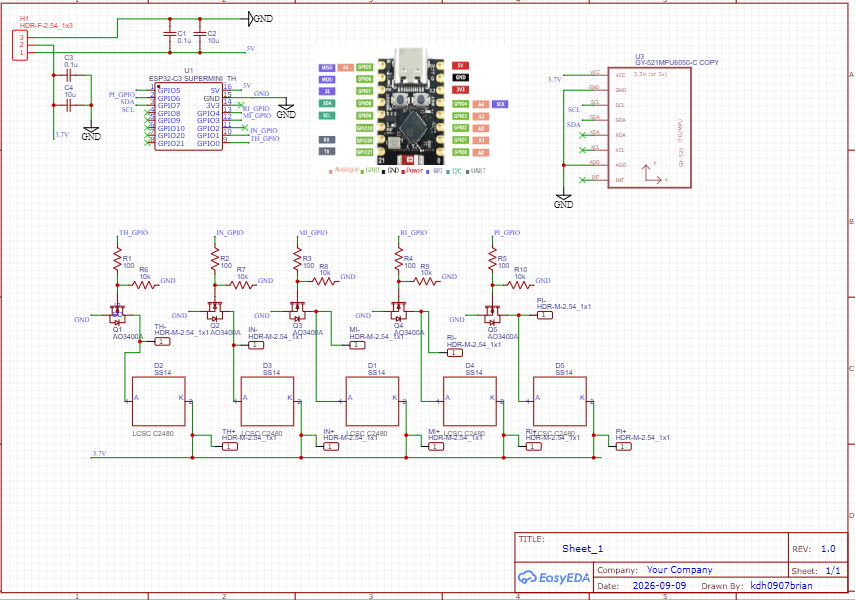
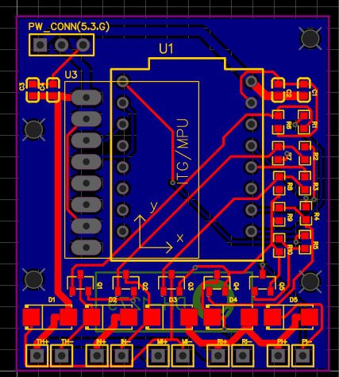
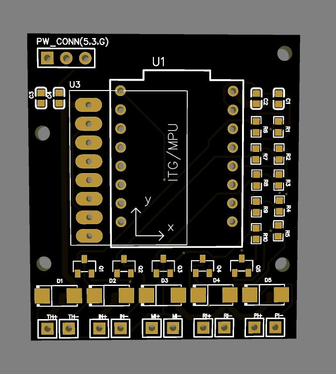

# 2026-10-04 장갑 햅틱 PCB 발주 및 조립 준비

작성일: 2026-10-05

대상: ESP32-C3 SuperMini와 GY-521을 사용하는 손가락별 진동 모터 5채널 장갑

## 제작 및 주문 내용

2026-10-04에 JLCPCB에서 장갑용 PCB와 표면실장 조립(PCBA)을 각각 5장씩 주문했다. 사진과 아래의 연결 정보는 발주 당시 제공한 회로도·PCB 화면 및 EasyEDA 저장본을 기준으로 정리했다. 실제 제작품의 동작은 아직 시험하지 않았다.

| 항목 | 주문 화면의 내용 |
| --- | --- |
| PCB | 2층 보드, 5장, 표시 가격 $4.00 |
| PCBA | Economic PCBA, 5장, 표시 가격 $14.41 |
| 배송 | 표시 운임 $9.70 |
| 합계 | $28.11 |
| 주문 식별 | `W2026100416324573` |
| 결제 상태 | 카드 결제 2건 중 중복된 1건은 2026-10-05에 취소 처리됐다고 사용자 확인. 남은 주문의 결제 반영 및 생산 진행 상태는 별도 확인되지 않았다. |

위 금액은 주문 화면에 표시된 값이며, 카드에서 최종 정산된 금액을 뜻하지 않는다. 카드 번호와 승인번호는 이 문서에 기록하지 않는다.

PCB 외곽은 EasyEDA 저장본 기준 약 **37 × 42 mm**이며, 고정홀 4개가 있다. 회로도 및 배치에 포함된 `U1` ESP32-C3 SuperMini, `U3` GY-521, 전원 3핀 연결부와 모터 배선 패드는 JLCPCB 표면실장 대상에서 제외했다. 이 부분은 보드를 받은 뒤 조립한다.

## 발주 도면

### 회로도

### PCB 배선

### PCB 3D 배치

세 그림은 발주 당시 공유한 참조 이미지다. 원본 EasyEDA 프로젝트는 로컬 `C:\easyeda-data\projects\마이크로프로세서 캡스톤디자인`에 있으며, 이 문서에는 사진을 넣었다.

## 회로 및 연결 기준

- 손가락마다 코인형 진동 모터 1개를 사용해 엄지(TH), 검지(IN), 중지(MI), 약지(RI), 소지(PI)를 각각 제어한다.
- 각 채널은 ESP GPIO → 100Ω 직렬 저항 → AO3400A 게이트로 연결한다. 게이트에는 GND로 향하는 10kΩ 풀다운 저항을 둔다.
- AO3400A 소스는 GND, 드레인은 모터 −에 연결한다. 모터 +는 공용 모터 전원에 연결한다.
- SS14 다이오드는 모터 양단에 병렬로 둔다. **A는 모터 −/MOSFET 드레인, 띠가 있는 K는 모터 +**에 연결한다.
- GY-521은 ESP의 GPIO6(SDA)·GPIO7(SCL)로 연결하고 AD0는 GND에 연결한다. INT와 XDA/XCL은 이번 회로에서 사용하지 않는다.

| 기능 | ESP32-C3 GPIO | PCB 네트 |
| --- | ---: | --- |
| 엄지 | 0 | `TH_GPIO` |
| 검지 | 1 | `IN_GPIO` |
| 중지 | 3 | `MI_GPIO` |
| 약지 | 4 | `RI_GPIO` |
| 소지 | 5 | `PI_GPIO` |
| I²C SDA | 6 | `SDA` |
| I²C SCL | 7 | `SCL` |

전원 연결부 `PW_CONN(5,3,G)`의 **PCB 윗면 그림 기준 왼쪽부터** 1번 `5V`, 2번 배터리 +(`3.7V` 네트), 3번 `GND`다. 배터리 +는 PCB 밖에서 두 갈래로 나눈다. 한 갈래는 5V 승압 모듈을 거쳐 ESP의 5V 핀으로, 다른 갈래는 PCB의 2번 핀으로 들어가 모터 5개와 GY-521 VCC에 공급된다. 이는 **병렬 분기**이며 모터와 IMU를 직렬로 잇지 않는다. ESP의 `3V3` 핀은 배터리와 연결하지 않았다. C1·C2는 5V–GND, C3·C4는 배터리 전원–GND에 각각 0.1µF와 10µF로 배치했다.

이 구성에서는 별도의 3.3V 승강압 모듈이 필수 부품이 아니다. [PN-VM102 설명서](https://www.eleparts.co.kr/data/goods_old/design/product_file/Hoon/PN-VM102-K.pdf)는 모터의 기준 전압을 3V, 사용 범위를 2~5V로 제시하므로 1셀 LiPo의 완충 전압 약 4.2V가 범위에 들어간다. 진동 세기와 전류는 배터리 전압에 따라 달라질 수 있다. **GY-521은 구매한 모듈의 VCC 입력 범위와 온보드 레귤레이터 유무를 먼저 확인해야 한다.** MPU6050 칩 자체의 VDD 허용 범위는 2.375~3.46V이므로 칩에 4.2V를 직접 넣는 것으로 해석해서는 안 된다. 또한 GY-521의 SDA/SCL 풀업이 배터리 전압으로 올라가면 ESP GPIO의 허용 전압을 넘을 수 있어, 완충 배터리 조건에서 실제 SDA/SCL HIGH 전압을 측정한 뒤 연결한다. [MPU6050 데이터시트](https://invensense.tdk.com/wp-content/uploads/2015/02/MPU-6000-Datasheet1.pdf), [Espressif GPIO 전압 안내](https://docs.espressif.com/projects/esp-faq/en/latest/hardware-related/hardware-design.html#what-is-the-voltage-tolerance-of-gpios-of-esp-chips)

## 조립 부품

### JLCPCB가 표면실장하는 부품

아래 수량은 **PCB 한 장 기준**이다. 주문 화면에서는 5장분이 선택되어 있었다.

| 위치 | 부품 | LCSC 코드 | 한 장당 |
| --- | --- | --- | ---: |
| C1, C3 | 0.1µF, 50V, 0603 | `C14663` | 2 |
| C2, C4 | 10µF, 10V, 0603 | `C19702` | 2 |
| D1~D5 | SS14, SMA | `C2480` | 5 |
| Q1~Q5 | AO3400A, SOT-23 | `C20917` | 5 |
| R1~R5 | 100Ω, 0603 | `C22775` | 5 |
| R6~R10 | 10kΩ, 0603 | `C25804` | 5 |

### 보드 수령 후 별도 준비·실장할 물품

`김가네 부품 정리.xlsx`의 수량은 **구매 계획 수량**이다. 실제 보유·배송 완료 수량은 별도로 확인한다. 아래의 필요 수량은 **동작하는 장갑 한 대 기준**이다.

| 물품 | 한 대당 | 근거 및 준비 사항 |
| --- | ---: | --- |
| ESP32-C3 SuperMini | 1개 | 부품표 계획 3개. PCB의 `U1`에 직접 실장할 모듈. |
| GY-521 MPU6050 모듈 | 1개 | 부품표 계획 3개. PCB의 `U3`에 직접 실장할 모듈. |
| PN-VM102 진동 모터 | 5개 | 부품표 계획 10개. 각 손가락의 +/− 패드에 선을 직접 납땜. |
| 1셀 리튬폴리머 배터리 | 1개 | 부품표에는 1000mAh 2개와 2000mAh 2개가 후보로 기재됨. 실제 사용할 용량과 보호회로 유무 확인. |
| 배터리 충전 기능이 있는 5V 승압 모듈 | 1개 | ESP 5V 입력용. 논의한 후보는 SparkFun LiPo Charger/Booster 5V/1A `PRT-14411`; 구매·보유 여부 미확인. |
| 3선 전원 연결부와 배선 | 1세트 | PCB의 5V·배터리 +·GND에 맞는 2.54mm 3핀 연결부 또는 직접 배선. 핀 순서 확인. |
| 모터 배선·절연재 | 5채널분 | 모터별 2선, 납땜부 절연 및 장갑 착용 시 전선 당김 방지. |
| 모듈 실장용 핀헤더·스페이서 | 모듈별 1세트 | U1과 U3가 평면상 겹쳐 보이는 적층 배치다. 두 모듈의 실제 높이·USB 접근·안테나 주변 공간을 확인해 선택. |
| 전원 스위치 및 연결선 | 구성에 따라 | 배터리에서 5V 승압기와 모터/IMU 전원으로 갈라지기 전 전체 전원을 끌 수 있게 구성. 정격과 위치 확인. |

부품표의 ESP·GY-521 각 3개, 모터 10개는 **장갑 한 대 시제품**의 필요량을 넘는다. PCBA 5장 모두에 모듈과 모터를 실장하려면 각각 ESP 5개, GY-521 5개, 모터 25개가 필요하므로 계획 수량 대비 ESP 2개, GY-521 2개, 모터 15개가 추가로 필요하다. 5V 승압 모듈도 실장할 장갑 수만큼 준비해야 한다.

## 수령 후 확인할 항목

- [x] 중복 결제 1건 취소 처리(사용자 확인).
- [ ] 남은 PCB/PCBA 주문의 결제 반영 및 생산 진행 상태 확인.
- [ ] PCBA 실장 위치와 SS14의 K 띠 방향, AO3400A 방향 및 미실장 모듈 영역 확인.
- [ ] U1·U3 모듈을 가조립해 서로 닿지 않는 높이, USB 접근, 장갑에 고정할 위치 확인.
- [ ] 배터리 보호회로 유무, 5V 승압기 출력, 배터리 전원 분기, 공통 GND 및 스위치 경로 확인.
- [ ] 모듈을 꽂기 전에 PCB 전원 연결부 1번=5V, 2번=배터리 전압(완충 시 약 4.2V), 3번=GND를 테스터로 확인.
- [ ] 구매한 GY-521의 VCC 입력 범위와 내부 레귤레이터를 확인하고, 완충 배터리에서 SDA/SCL HIGH가 ESP GPIO 허용 범위를 넘지 않는지 측정. 저전압 배터리에서도 I²C 통신이 유지되는지 확인.
- [ ] ESP 단독 부팅 및 BLE 통신 확인 후 GY-521 I²C 응답 확인.
- [ ] 모터 한 개부터 구동하고 5개 동시 구동 시 전압강하·리셋·발열을 측정.

## 관련 자료

- [2026-09-24 장갑 PCB 회로 검토 및 핀 배치](2026-09-24_장갑_PCB_회로_검토_및_핀_배치.md): 초기 회로 검토 이력. 전원 구성과 패드 상태는 이번 발주본이 이후 결정이므로 이 문서를 기준으로 읽는다.
- 로컬 부품표: `00. 캡스톤 관련 문서/김가네 부품 정리.xlsx`, `Sheet1!B12:F17`.
- [SparkFun LiPo Charger/Booster 5V/1A PRT-14411](https://www.sparkfun.com/sparkfun-lipo-charger-booster-5v-1a.html): 논의한 5V 전원 후보.
- [현재 ESP32 수신 펌웨어](../esp32_device/firmware/haptic_receiver/haptic_receiver.ino): 5개 모터 GPIO 배치 대조용. PCB 실물에서 모터 구동 시험을 끝냈다는 뜻은 아니다.
