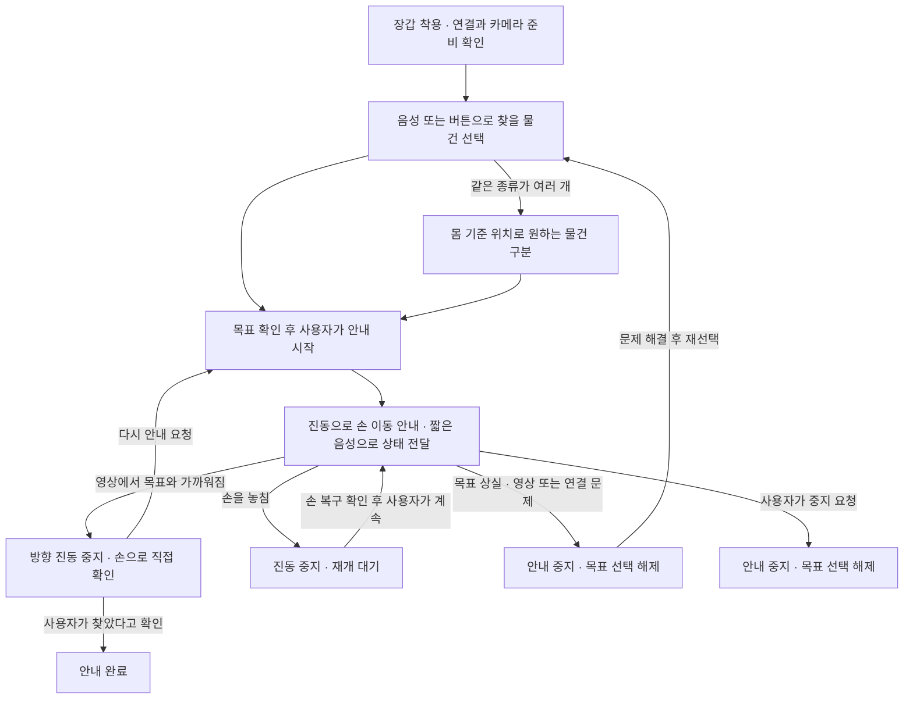

# 비전 기반 햅틱 글러브: 유저 리서치와 UI·UX 개선안

- 작성일: 2026-10-07
- 대상: 고정 카메라 1대 + Raspberry Pi 5 / AI HAT+ 2 + ESP32-C3 + 손가락 진동 모터 5개
- 방법: 기존 EyeVoice 조사 재해석, 공개 1차 연구·접근성 지침 검토, 현재 저장소 코드 분석
- **이번 작업은 데스크 리서치다. 새로운 인터뷰나 시각장애인 대상 사용성 시험을 실시한 결과가 아니다.**
- 관련 산출물: [구현용 UX 명세](2026-10-07_DH_접근성_UX_구현명세.md), [조작 가능한 화면 시안](prototypes/haptic-accessible-ux.html)

## 1. 제안하는 제품 방향

**사용자가 책상 위에서 찾을 물건을 선택하고, 짧은 음성과 조절 가능한 진동 안내를 받아 손을 가까이 이동한 뒤 직접 확인하는 도구**로 MVP를 정의한다.

물체를 인식하는 것과 사용자가 실제로 물건을 찾는 것은 다르다. 선택, 방향 이해, 추적 실패 복구, 중지, 직접 확인까지 연결되어야 한다. 현재 단일 카메라의 영상상 근접도를 실제 거리나 잡기 성공으로 표현하지 않는다.

권장 기본 경험은 다음과 같다. 아래는 사용자 시험으로 검증할 **설계안**이다.

1. 시작 시 준비 상태와 사용 방법을 한 번 안내한다.
2. 사용자가 “목록”을 요청하거나 물건 이름을 말한다. 목록의 5초 주기 반복은 기본값에서 제외한다.
3. “컵이 두 개 보입니다”처럼 선택이 모호할 때만 추가 질문을 한다.
4. 목표와 시작 의도를 확인하고 손 안내를 시작한다.
5. 이동은 진동을 중심으로, 상태 변화는 짧은 음성과 텍스트로 전달한다.
6. 손 추적이 끊기면 출력을 멈추고, 손이 돌아와도 사용자가 재개하기 전까지 기다린다.
7. 영상에서 목표와 가까워지면 방향 진동을 멈추고 직접 확인을 요청한다. 사용자가 완료를 알린다.

### 한눈에 보는 사용 흐름



중지 요청은 그림에 표시한 안내 단계뿐 아니라 **모든 단계에서 가능**하다. 연결이 끊긴 경우 실제 모터 출력은 ESP32 수신기 만료 처리로 꺼지며, 즉시 OFF가 확인된 것으로 표시하지 않는다. 위 흐름은 제안하는 UX이며 실제 제어 코드 반영 전이다.

## 2. EyeVoice에서 이어받을 근거와 한계

### 원자료 확인

첨부된 `d4462e17-d245-4be3-95eb-de0ae8bb4553_EyeVoice_서비스_전략_기획안.pdf` 14쪽을 텍스트로 확인하고, 인터뷰·퍼소나·서비스 전략이 있는 8~10쪽 및 12~14쪽을 이미지로 확인했다. 아래 쪽수는 PDF 페이지 기준이다.

8쪽에는 2024-07-22~25, **시각장애 관련 산업 종사자·시각장애인·저시력자 총 6명**의 인터뷰가 기재되어 있다. 각 집단의 인원, 개인별 응답, 질문지, 분석 절차는 제공된 문서에서 확인할 수 없다. 따라서 “시각장애인 6명 전원이 이렇게 말했다”로 확대 해석하지 않는다. 10쪽의 퍼소나는 설계용 인물이며, 해당 인물의 문장을 실제 인터뷰 인용으로 사용하지 않는다.

| EyeVoice의 내용 | 근거 위치 | 이번 프로젝트에서의 해석 | 바로 일반화하면 안 되는 점 |
|---|---|---|---|
| OCR의 표·숫자·곡면 인식 한계 | 8쪽 | 인식 결과가 틀릴 수 있음을 고려한 확인·취소·복구 흐름 필요 | OCR 오류가 곧 YOLO 오류율이나 장갑의 효과를 뜻하지 않음 |
| 작은 글씨, UI 배율 조절 어려움 | 8~9쪽 | 글자 확대, 단일 열, 충분한 대비, 명확한 버튼명 | 큰 글씨·검은 배경 하나가 모든 저시력자에게 최적인 것은 아님 |
| 단순한 이미지 설명으로는 의미 파악이 어려움 | 8~9쪽 | 물체 이름 외에 선택한 대상과 다음 행동을 알려주기 | 매 순간 자세한 설명을 원하는 것으로 해석하지 않음 |
| 화면 확대·VoiceOver 등 활용 | 9쪽 | 기존 화면낭독기와 확대 기능을 유지하고 표준 컨트롤 사용 | 음성 입력만 있으면 접근성이 확보되는 것은 아님 |
| 간단한 탐색, 명확한 버튼, 대비 설정, 지속 시험 | 13~14쪽 | 상태·목표·중지 중심의 단순한 화면과 개인 설정 | 원자료의 성장 목표·정확도 목표는 달성 실적이 아님 |

EyeVoice의 OCR·문서 편집·현관 설명 요구는 이번 책상 위 손 안내 MVP에 추가하지 않는다. 원자료의 과거 인구·웹 접근성 통계도 이 장갑의 필요성이나 효과를 직접 입증하는 수치로 재사용하지 않는다.

## 3. 외부 연구에서 확인한 점

### R1. 탐색에 필요한 정보량은 개인마다 다르다

ObjectFinder 연구는 시각장애인 8명의 요구 조사와 같은 참여자들의 실험실 탐색 평가를 수행했다. 정보량 선호가 나뉘었고, 이미 들은 개요의 반복을 줄이고 필요할 때 다시 듣고 싶다는 의견이 있었다. 착용·처리 속도의 부담도 보고했다. [ObjectFinder, 2024 공개 원고, §4~5](https://arxiv.org/html/2412.03118v1)

**설계 추론:** “5초마다 전부 말하기”보다 요청형 목록을 기본으로 하고, 자동 안내는 선택 옵션으로 둔다. 이 연구는 방 안에서 물건을 찾는 별도 장치 연구이므로, 우리의 적정 안내 간격이나 손 도달 성능을 증명하지 않는다.

### R2. 진동은 음성을 보완하지만 우월성이 보장되지 않는다

HandSight 관련 연구는 시각장애인 19명의 문장 추적 과제에서 음성·햅틱 방향 안내를 비교했고, 4명에게 착용형 시제품 후속 의견을 받았다. 전반적 성능은 유사했으며 음성과 읽기 음성의 간섭, 진동에 대한 감각 둔화 가능성, 집중 부담을 보고했다. [Stearns 외, 2016, 저자 소속기관의 논문 초록](https://pure.ewha.ac.kr/en/publications/evaluating-haptic-and-auditory-directional-guidance-to-assist-bli/)

**설계 추론:** 진동 강도 조절·중지·연습을 제공하고 음성 중심 모드도 비교한다. 글자 줄을 따라가는 과제의 결과를 5개 손가락 방향 매핑이나 물체 집기 결과로 일반화하지 않는다.

### R3. 필요한 것은 일반적인 ‘컵’일 수도, 특정한 ‘내 물건’일 수도 있다

Find My Things는 14~25세 시각장애·저시력 청년 8명과 공동 설계한 개인 물체 탐색 시스템이다. 사용자가 자신의 물건을 등록하고 시각·음성·진동 피드백을 이용하는 경험을 연구했다. [Find My Things, ASSETS 2023 원고, §3](https://www.microsoft.com/en-us/research/uploads/prod/2023/08/FindMyThings-ASSETS-2023.pdf)

**설계 추론:** MVP에서는 “컵 종류를 감지함”과 “사용자의 특정 컵임을 식별함”을 구분한다. 같은 종류의 물체가 여럿이면 선택을 요청한다. 개인 물건 등록은 후속 과제로 남긴다. 해당 연구의 스마트폰·3D 위치 처리 결과를 Pi의 2D 카메라 성능으로 옮기지 않는다.

### R4. 저시력자를 위한 단 하나의 표시 방식은 없다

W3C의 저시력 사용자 요구 문서는 시력·시야·눈부심·대비 민감도와 환경에 따른 차이를 설명한다. 큰 글씨가 필요한 사람과 좁은 시야 때문에 작은 영역에 정보를 모아야 하는 사람의 요구가 다를 수 있다. 이 문서는 **요구 분석용 Working Draft이며 적합성 표준은 아니다.** [W3C Low Vision Needs, §2~3](https://www.w3.org/TR/low-vision-needs/)

**설계 추론:** 밝은/어두운 화면과 크기 설정을 제공하되 OS·브라우저 확대를 막지 않는다. 시력을 진단하거나 장애 등급을 묻고 테마를 자동 지정하지 않는다.

### R5. 접근성 점검과 실제 사용자 평가는 함께 필요하다

W3C는 실제 장애 사용자의 참여가 체크리스트만으로 발견하지 못하는 문제를 찾는 데 중요하고, 소수 참여자의 결과를 모든 장애 사용자에게 일반화하면 안 된다고 설명한다. [W3C, Involving Users in Evaluating Web Accessibility](https://www.w3.org/WAI/test-evaluate/involving-users/)

**적용:** 코드·화면 기준 검사는 먼저 수행하되, 그 결과를 장갑의 사용성 검증이나 사용자 만족도 결과로 보고하지 않는다.

## 4. 누구의 어떤 상황을 먼저 지원할 것인가

아래는 모집과 설계를 위한 **가설적 사용자 구분**이다. 실제 인터뷰로 만든 새로운 퍼소나가 아니다. 저시력자도 시각장애 범주에 포함될 수 있으므로 진단명보다 이용 방식에 초점을 둔다.

| 이용 방식 | 중요한 과업 | 예상 장벽 | 제안 |
|---|---|---|---|
| 화면을 거의 이용하지 않고 음성·촉각으로 조작 | 목표 선택, 방향 이해, 중지와 복구 | 화면에만 뜨는 오류, 외워야 할 많은 진동 패턴 | 화면 없이 가능한 흐름, 짧은 안내, 촉각적으로 찾기 쉬운 조작부 |
| 잔존 시력·확대를 음성과 함께 이용 | 물체·상태를 직접 확인하며 안내받기 | 작은 버튼, 영상 위 작은 글씨, 확대 시 잘리는 조작부 | 확대 가능한 별도 텍스트, 단순한 화면, 대비 선택 |
| 진동을 구분하기 어렵거나 착용이 불편 | 손가락 감각을 유지하며 탐색 | 진동 피로, 장갑 압박, 손끝 감각 차단 | 강도·음성 보조 선택, 착용 수정; 현재 장갑 적합성부터 확인 |
| 설치·시험을 돕는 팀원 또는 보조자 | 카메라 정렬, 센서 점검, 오류 원인 확인 | 사용자 화면에 기술 지표가 섞임 | 별도 점검 영역; 사용자는 로그·FPS를 읽을 필요가 없게 구성 |

**1차 사용 장면:** 앉은 상태, 고정 카메라가 보는 정해진 책상 영역, 지정한 한 손, 안전한 일상 물체. 매번 장갑을 끼는 비용을 감수할 만큼 도움이 되는지가 핵심 질문이다. 익숙한 책상에서 원래 정리 습관이나 손으로 찾는 방법이 더 빠를 가능성도 비교해야 한다.

**MVP 범위 밖:** 실내 보행 안내, 위험물 판단, 약품 종류·복용법 확인, 뜨거운 내용물 판단, 실제 깊이·잡기 성공 판정. 탐지하지 못했다는 결과는 물건이 없다는 증거가 아니다.

## 5. 사용자 여정과 바꿀 경험

| 단계 | 사용자 질문 | 제공할 정보·행동 | 실패 시 복구 |
|---|---|---|---|
| 준비 | 켜졌나? 지금 사용할 수 있나? | 장갑 연결·카메라 준비, 시작 위치, 중지 방법 1회 안내 | 준비되지 않은 항목을 일상 언어로 설명 |
| 목록 | 무엇을 찾을 수 있나? | 현재 안정적으로 감지한 종류·개수; 요청할 때 목록 | “현재 확인하지 못했어요”; 지원 종류와 현재 감지는 구분 |
| 선택 | 내 말을 제대로 알아들었나? | 인식된 물체 이름 확인; 중복은 위치별 선택 | 오인식 취소, 다시 말하기/버튼 선택 |
| 이동 | 어느 쪽으로 손을 움직이나? | 몸 기준 방향, 진동; 요청 시 짧은 음성 | 손·목표·연결 상실마다 출력 0, 원인과 다음 행동 |
| 근접 | 이제 잡으면 되나? | “영상에서 목표와 가까워졌어요. 손으로 확인해 주세요.” | 자동 잡기 성공 선언 금지; 다시 안내 가능 |
| 완료 | 끝났나? 다음은? | 사용자의 “찾았어”/완료 버튼 후 진동 종료 확인 | 새 목표는 새로 선택; 의도치 않은 재시작 방지 |

## 6. 현재 코드와 비교한 개선 우선순위

검토 기준은 로컬 `DH-1279/2026-10-06`, `aa90729`의 파일이다. 다른 팀원 브랜치의 미병합 변경까지 구현된 것으로 간주하지 않았다. **아래 변경안은 현재 런타임에 적용된 기능 목록이 아니다.**

| 우선순위 | 확인한 현재 동작 | 제안하는 UX 변경 | 수정 대상 / 확인 방법 |
|---|---|---|---|
| P0 | `audio.py`는 TTS·변환 중 입력을 버림 | 발화와 독립적인 중지 경로 확보, TTS 취소와 출력 중지를 함께 처리 | `audio.py`, `runtime.py`, 버튼 입력; 말하는 중에도 중지 시험 |
| P0 | `_request()`는 부분 문자열로 목표 판정 | 지원 명령 문법·부정문·모호한 명령을 구분; 인식 오류로 안내 시작 방지 | `controller.py`; “컵 말고 책”, “책상”, 무관한 발화 시험 |
| P0 | 목표 선택과 안내가 같은 단계에서 시작 가능 | 목표 확인 후 명시적 시작; 숙련 모드는 추후 검증 | `controller.py`, `runtime.py`; 확인 대기 중 모터 0 |
| P0 | 손이 돌아오면 자동 안내 재개 | 일시정지 상태를 유지하고 “계속”에만 재개 | 상태 전이 시험; 같은 목표·최신 프레임 재확인 |
| P0 | `near`에서 소지 채널 강도 160을 계속 출력 | 영상상 근접 안내 후 방향 진동 종료, 사용자 완료 확인 | 근접/이탈/재안내 시험; 실제 도달 검증과 분리 |
| P0 | 중복 물체 좌우 정렬은 원본 영상 X 기준 | 방향 안내와 동일한 사용자 기준 좌표로 중복 선택 | 회전·반전한 카메라의 좌우 선택 시험 |
| P1 | `announce_interval_s=5`로 같은 목록 반복 | 최초/요청형 기본, 선택적 변화 안내; 동일 목록 중복 억제 | `controller.py`, 설정 스키마; 변화 없는 30초 동안 반복 없음 |
| P1 | 다섯 손가락의 방향 매핑·강도가 고정 | 착용 연습, 강도 설정, 방향 이해도 비교시험 | 설정·수신 펌웨어; 좌우·앞뒤 혼동 기록 |
| P1 | `목록` 요청이 현재 목표를 해제 | 목표 유지 여부를 명확히 정의; 목록 중 일시정지 후 사용자 재개 | 명령 의미·테스트 정리 |
| P1 | 터미널/선택적 영상 미리보기 중심 | 사용자 화면과 개발 점검 화면 구분 | 표준 버튼·텍스트 상태·키보드·화면낭독기 시험 |

P0는 특히 실제 모터를 사람에게 착용시켜 시험하기 전에 정리할 항목이다. 코드의 BLE 만료 시 OFF, 오래된 영상 차단, 목표 상실 후 재선택은 유지할 가치가 있다. UI가 이 보호 동작을 우회해서는 안 된다.

## 7. 음성·촉각·화면의 역할

### 음성: 선택과 상태 설명

- 준비, 대상 확인, 실패 원인, 다음 행동을 짧게 알린다.
- 목록은 사용자가 요청할 때 제공한다. “조용히”는 일반 설명을 줄이는 설정이며, “정지”는 모터를 끄는 행동으로 구분한다.
- 주변 대화의 물체 이름을 명령으로 오인하지 않도록 초기에는 누르고 말하기 같은 명시적 요청 방식을 검토한다. 이 버튼은 아직 하드웨어에 구현되지 않았다.
- TTS 재생 중 음성 중지는 현재 불가능하다. 화면 버튼·키보드만으로 화면 없는 사용을 해결했다고 주장하지 않는다. 접근 가능한 물리 조작부와 입력 경로를 별도 확보해야 한다.

### 촉각: 이동 안내와 착용 검증

- 현재 왼쪽=엄지, 오른쪽=검지, 앞=중지, 뒤=약지, 근접=소지는 임시 매핑이다. 손가락 위치가 사용자에게 그 방향으로 자연스럽게 해석되는지 미확인이다.
- 처음에는 방향 4개를 하나씩 설명하고 사용자가 의미를 되말하거나 움직여 확인한다. 구별이 어려우면 음성 보조 또는 더 단순한 패턴과 비교한다.
- 강도·펄스 길이는 실제 모터와 착용 상태에서 정한다. PWM 숫자를 감각 강도나 안전한 전압의 증거로 삼지 않는다.
- 손을 돌려도 기준은 사용자의 몸으로 유지한다. IMU만 추가했다고 좌표 보정이 완료되는 것은 아니다.
- 손끝 촉각, 잡기 동작, 장갑 무게·열·배선 걸림을 함께 평가한다. 진동 신호의 정확도만 높아도 착용을 기피하면 제품 가치가 낮다.

### 화면: 직접 조작을 위한 선택지

주요 정보는 **현재 상태, 선택한 물체, 다음 행동, 중지**다. 카메라 영상과 기술 지표는 접어 둔 점검 영역으로 옮긴다. 화면은 보조자 전용으로 제한하지 않고, 저시력 사용자와 화면낭독기 사용자도 직접 조작할 수 있도록 만든다. 세부 기준은 [구현 명세](2026-10-07_DH_접근성_UX_구현명세.md)에 정리했다.

## 8. 데이터셋에 반영할 사용자 관점

첫 시험은 기존 구성의 컵·물병·휴대전화·책·마우스로 시작하되 **사용자에게 중요한 물건인지 조사한 결과는 아직 없다.** 참여자에게 최근 찾기 어려웠던 물건을 먼저 묻고, 빈도·불편·현재 지원 가능성을 함께 기록한다.

평가 장면은 서로 다른 모양의 같은 종류, 비슷한 배경색, 부분 가림, 여러 물체, 손의 가림, 조명 변화, 장갑 착용을 포함한다. YOLO 검출과 장갑 낀 손의 추적을 따로 평가한 뒤 전체 과업을 시험한다. 학습·평가 영상을 같은 촬영 묶음에서 무작위로 나누기보다 촬영 세션·배경·물체 개체 단위로 분리해 누출을 줄인다.

열쇠나 약통은 후보 수요로 조사할 수 있지만 자동으로 지원한다고 안내하지 않는다. 약통 탐지는 약 종류·정확한 복용의 판정과 별개다. 개인 물체 구별 기능은 범용 클래스 탐지 이후 별도 데이터와 검증이 필요한 확장이다.

## 9. 실제 사용자 조사 계획

### 모집과 진행

**제안:** 첫 형성평가 6명 안팎으로 시작해 개선 후 다시 평가한다. 이는 대표성이나 통계적 효과 검증을 보장하는 표본 수가 아니다. 화면을 주로 사용하지 않는 사람과 잔존 시력·확대를 활용하는 사람을 포함하고, 보조기술 숙련도·주 사용 손·진동 감지 편안함의 차이를 기록한다. 실제 사용자가 참여하기 전 개발자의 눈가림 시험은 코드·장치 점검으로만 표기한다.

접근 가능한 안내문과 참여·녹음 동의, 중단·휴식 선택, 교통·참여 보상을 준비한다. 진단명·개인정보는 과업에 필요하지 않으면 수집하지 않는다. 영상·음성 원본은 별도 동의 없이 저장하지 않고 공개 Git에 올리지 않는다. 당사자에게 먼저 질문하며 보조자의 의견은 별도 기록한다.

### 인터뷰 질문: 해결책을 소개하기 전에 묻기

1. 최근 책상 위 물건을 찾기 어려웠던 상황을 처음부터 설명해 주세요.
2. 그때 어떤 방법을 썼고, 어느 지점에서 시간이 걸렸나요?
3. 물건을 원래 둔 자리와 다른 곳에서 찾게 되는 경우가 있나요?
4. 자주 찾는 물건 세 가지와, 서로 구분해야 하는 비슷한 물건이 있나요?
5. 화면 확대·화면낭독기·음성 입력을 어느 상황에서 쓰나요?
6. 안내를 듣기 어렵거나 공개적으로 말하기 불편한 상황이 있나요?
7. 손에 장치를 착용하면 원래 하던 동작에 어떤 영향을 줄 것 같나요?
8. 장치가 잘못 안내한다고 느끼면 어떻게 확인하거나 멈추고 싶나요?

“진동이 편하시죠?”처럼 답을 유도하지 않는다. 원자료와 해석은 분리하고 참여자 ID만 기록한다.

### 시험 과업

| 과업 | 관찰할 점 |
|---|---|
| 기존 방법으로 물건 찾기 | 원래 전략·도움 요청·소요 시간; 비교 기준 |
| 장갑 착용 및 방향 연습 | 스스로 착용 가능한지, 혼동하는 채널, 감각 방해 |
| 단일 물체 선택 후 찾기 | 목표 이해, 시작 의도, 과도한 이동, 직접 확인 |
| 같은 종류 2개 중 선택 | 사용자 기준 좌우 해석, 잘못 선택했을 때 수정 |
| 인식되지 않는 물체 요청 | “없음”과 “확인 못함”의 차이를 이해하는지 |
| 손 가림·목표 상실·연결 끊김 | 진동 중지 인지, 복구 이해, 임의 재개 발생 여부 |
| 안내 재생 중 중지 | 접근 가능한 대체 조작으로 실제 모터가 멈추는지 |
| 큰 글씨/테마/키보드로 조작 | 확대 후 필수 버튼 접근, 초점, 화면낭독기 상태 전달 |

마른 빈 컵·닫힌 물병 등으로 정돈된 책상에서 진행한다. 사용자에게 익숙한 보조 수단은 허용하고 기록한다. 진행자의 물리적 개입이 있었다면 독립 성공으로 세지 않는다. 행동 중 계속 말하게 하면 음성·진동 집중을 방해할 수 있으므로 과업 후 회고를 함께 사용한다.

### 비교할 설계와 지표

- 안내량 비교: 같은 목록 반복 / 요청형 안내. 서로 다른 동등한 배치를 사용하고 순서를 교차한다.
- 안내 수단 비교: 음성 중심 / 음성+진동. 장갑 효과를 처음부터 우수하다고 가정하지 않는다.
- 독립 과업 성공: 정한 시간 내 올바른 실물 확인, 진행자의 신체 도움 없음. 시간 제한은 예비시험 후 정한다.
- 소요 시간은 착용·설정 시간과 탐색 시간을 따로 기록하고, 실패·포기 건수를 함께 보고한다.
- 오선택·중지 실패·재선택 횟수·반복 질문·좌우/앞뒤 혼동을 기록한다.
- 불편·정신적 부담·진동 구별·다시 쓸 의향은 동일한 질문과 척도로 확인하되 소수 표본의 평균만으로 결론내리지 않는다.
- 지연은 STT 완료, 제어 결정, BLE 수신, 실제 모터 OFF를 구분한다. PC 시뮬레이션의 실행 시간은 실제 장치 지연이 아니다.

DAU나 앱 리뷰보다 위 과업 지표가 현재 시제품의 판단에 적합하다. 목표 수치는 예비시험 이전에는 확정하지 않고, 중지 실패·의도치 않은 재개·오대상 이동은 다음 착용 시험 전에 해결한다.

### 기록 양식

```text
참여자 ID / 날짜 / 사용 보조기술 / 주 사용 손:
과업 / 조건 / 물체 배치 ID / 소프트웨어 버전:
사용자 요청 → 인식 내용 → 선택한 대상 → 실제 확인한 대상:
성공·실패·포기 / 소요 시간 / 진행자 개입:
상태 전이 / 추적 상실 / 중지 경로 / 실제 출력 확인:
관찰 사실:
참여자의 실제 발언(동의받은 경우):
팀의 해석 및 다른 가능한 설명:
다음 변경 / 재시험 결과:
```

## 10. 팀 실행 순서

| 순서 | 작업 | 기존 역할을 고려한 담당 제안 | 완료 증거 |
|---|---|---|---|
| 1 | 이 문서·시안으로 명령과 상태 의미 통일 | 전원 | 시작·중지·재개·완료 정의 합의 |
| 2 | 중지 경로, 음성 취소, 명령 오인식 방지 | 김민주 + 김동환 | TTS 중 정지·재연결·오명령 시험 기록 |
| 3 | 카메라 좌표 정렬, 중복 물체 및 손 가림 처리 | 김해수 + 김민주 | 회전·반전·가림 장면 재현 결과 |
| 4 | 모터 개별 시험, 강도 조정·착용 연습 | 김동환 | 실제 출력·전원·착용 확인 기록 |
| 5 | 접근 가능한 사용자 화면과 상태 동기화 | 김민주 | 키보드·확대·화면낭독기 점검 |
| 6 | 당사자 형성평가 후 수정 | 전원 | 익명화된 관찰·변경·재시험 문서 |

담당은 새로 확정한 역할 분담이 아니라 9월 29일 회의록을 토대로 한 제안이다. 이번 산출물은 연구·설계와 모의 화면이며, 실제 음성·BLE·모터 코드의 동작 변경은 별도 구현 과제다.

## 참고 자료

- 사용자 제공 EyeVoice 서비스 전략 기획안, PDF 8~10·12~14쪽. 원본은 첨부 파일로 보관하며 저장소에 복제하지 않았다.
- [ObjectFinder 원문](https://arxiv.org/html/2412.03118v1): 요구 조사·탐색형 평가, 정보량과 물체 선택.
- [HandSight 관련 논문](https://doi.org/10.1145/2914793): [확인한 저자 소속기관 초록](https://pure.ewha.ac.kr/en/publications/evaluating-haptic-and-auditory-directional-guidance-to-assist-bli/). 초록 범위를 넘어 효과 크기를 주장하지 않음.
- [Find My Things 원고](https://www.microsoft.com/en-us/research/uploads/prod/2023/08/FindMyThings-ASSETS-2023.pdf): 공동 설계와 개인 물건 탐색.
- [W3C Low Vision Needs](https://www.w3.org/TR/low-vision-needs/): 요구 분석용 초안.
- [W3C 사용자 참여 평가](https://www.w3.org/WAI/test-evaluate/involving-users/): 사용자 평가와 적합성 평가의 구분.
- [WCAG 2.2](https://www.w3.org/TR/WCAG22/): 웹 화면의 기준. 장갑 하드웨어의 사용성 인증 기준으로 사용하지 않음.

외부 자료 확인일: 2026-10-07. 연구 결과와 위에서 도출한 팀 설계 가설은 구분해서 인용한다.
