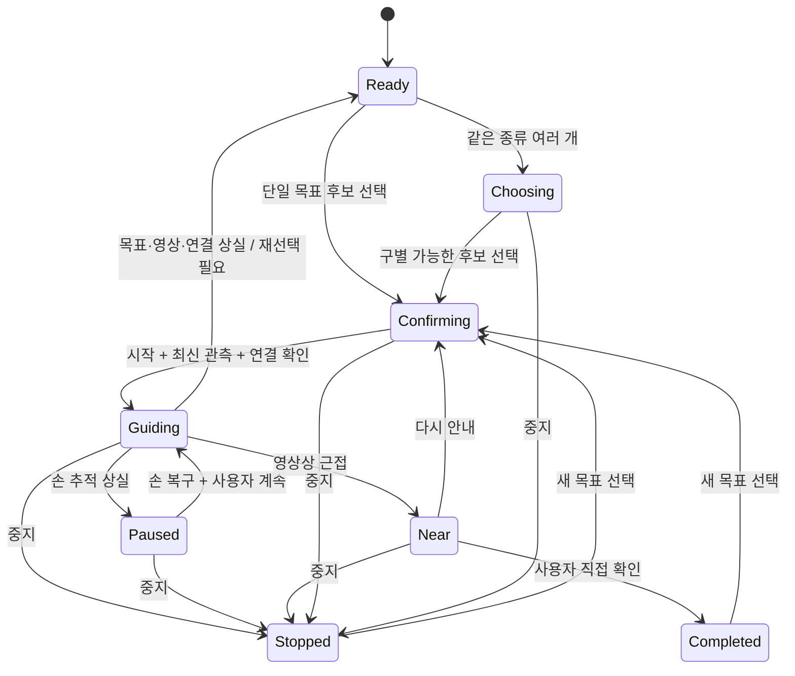

# 접근성 UX 구현 명세: 책상 위 물체 탐색

- 날짜: 2026-10-07
- 근거: [유저 리서치와 개선안](2026-10-07_DH_유저리서치_UIUX_개선안.md)
- 상태: **제안 명세. 기존 Python·ESP32 런타임에는 아직 반영하지 않았다.**
- [화면 시안 열기](prototypes/haptic-accessible-ux.html): 파일을 내려받아 브라우저로 열면 동작한다. 가상 물체와 텍스트 상태만 사용하며 카메라·음성·BLE·모터와 연결하지 않는다.

## 1. 기본값과 화면 구성

사용자 홈의 정보 순서는 현재 상태 → 선택한 물체 → 다음 행동 → 조작이다. 카메라 영상은 홈을 차지하지 않는다. 준비 중인 설정도 완료된 것처럼 녹색 표시하지 않는다.

| 항목 | 제안 기본값 | 이유 |
|---|---|---|
| 물체 목록 | 시작 안내 이후 요청할 때 제공 | 불필요한 반복 줄이기; 연구에서 정보량 선호가 나뉨 |
| 선택 확인 | 목표 후보를 알리고 명시적 시작 | STT 오인식으로 갑자기 진동하는 상황 방지 |
| 안내 방식 | 짧은 상태 음성 + 진동, 음성 중심 옵션 | 익숙함·감각 차이에 대응; 사용자 평가 필요 |
| 중지 | 취소 확인 없이 즉시 출력 OFF | 목표 변경보다 높은 우선순위 |
| 손 추적 복구 | 일시정지 유지, 명시적 재개 | 손이 보였다는 이유만으로 임의 재시작하지 않음 |
| 목표/연결 상실 | 선택 무효화, 재선택 | 다른 대상에 잘못 안내하지 않음 |
| 근접 | 방향 출력 OFF + 직접 확인 요청 | 영상 근접과 실제 잡기는 다름 |
| 영상·음성 보관 | 기본 보관 안 함 | 시험용 기록은 별도 동의와 로컬 보관 |

사용자 홈에는 목록 요청, 목표 선택, 안내 시작/계속, 중지, 찾았어요, 다시 듣기를 둔다. 아직 가능한 단계가 아닌 조작은 이유를 알리고 비활성화한다. 음성 입력은 동등한 명령 경로다. 접근성 설정은 글자 크기·밝은/어두운 화면·안내량·음성 속도·진동 강도를 포함한다. 시안에서는 실제 효과가 있는 글자 크기·테마만 제공한다.

개발 점검 화면에는 카메라 미리보기, 프레임 시각, 손·목표 추적, BLE 상태, 명령 시각, 실제 확인된 출력 정보를 둔다. 배터리 측정 기능이 없으면 잔량 퍼센트를 만들지 않는다. 디버그 항목을 사용자에게 읽어주지 않는다.

## 2. 상태와 출력 계약



다이어그램에 생략된 상태에서도 **중지 입력은 항상 유효**하다. 준비되지 않은 장치에서는 `Ready` 대신 원인이 명시된 `NotReady`이며 안내를 시작하지 않는다.

| 상태 | 출력 | 음성/텍스트 예시 | 다음 행동 |
|---|---|---|---|
| 준비됨 | 0 | “준비됐어요. 찾을 물건을 말하거나 목록을 선택해 주세요.” | 목표 또는 목록 |
| 후보 구분 | 0 | “컵이 두 개 보여요. 몸 기준 왼쪽과 오른쪽 중 골라 주세요.” | 후보 선택, 중지 |
| 시작 확인 | 0 | “왼쪽 컵을 선택했어요. 안내를 시작할까요?” | 시작, 다른 목표, 중지 |
| 안내 중 | 검증된 방향 패턴 | “왼쪽 컵으로 안내해요.” | 계속 이동, 중지 |
| 손 상실 | 즉시 0 | “손을 확인하지 못해 멈췄어요.” | 손을 시작 영역에 두기 |
| 손 복구 대기 | 0 | “손을 다시 확인했어요. 계속할까요?” | 계속 또는 중지 |
| 목표 상실 | 즉시 0, 선택 무효화 | “선택한 컵을 놓쳤어요. 다시 선택해 주세요.” | 재선택 |
| 영상 오래됨 | 즉시 0, 선택 무효화 | “영상이 멈춰 안내를 중지했어요.” | 영상 복구 후 재선택 |
| 연결 끊김 | 명령 중지, 수신기 만료 시 OFF | “장갑 연결이 끊겼어요. 연결 후 다시 선택해 주세요.” | 연결 확인 후 재선택 |
| 영상상 근접 | 방향 출력 0 | “영상에서 목표와 가까워졌어요. 손으로 확인해 주세요.” | 찾았어요 또는 다시 안내 |
| 완료 | 0 | “찾기 안내를 마쳤어요.” | 새 목표 |
| 중지 | 0, 미처리 시작·음성 무효화 | “안내를 멈췄어요.” | 새 목표 |

BLE가 끊겼을 때 UI는 실제 모터 OFF 확인을 받았다고 주장하지 않는다. 연결 해제와 수신기 watchdog은 별개이며 OFF까지의 실측 지연을 기록한다. 프레임이 오래됐거나 후보 ID가 바뀌었으면 화면에 남은 버튼을 눌러도 안내를 시작하지 않는다.

현재 Controller의 `scanning/guiding/paused/stopped` 위에 필요한 상태를 명시적으로 추가하고, UI 문자열만으로 상태를 판단하지 않는다. `Near`는 이름 그대로 영상상 근접이다. 실제 제품에 “잡으세요”, “도착했습니다”를 확정적으로 출력하지 않는다.

## 3. 명령 의미

| 입력 | 의미 | 기존 코드와 차이 |
|---|---|---|
| “컵 찾아줘” / 물체 버튼 | 후보 선택 후 시작 확인 | 즉시 안내 시작에서 변경 |
| “왼쪽” / 후보 버튼 | 대기 중인 후보를 사용자 좌표로 선택 | 원본 영상 좌우 정렬 수정 필요 |
| “시작”, “네” | 확인 대기 중인 최신 후보로 시작 | 다른 상태에서의 “네”는 시작으로 해석하지 않음 |
| “정지”, “멈춰”, 중지 버튼 | 출력 0, 목표·대기 명령 해제 | TTS 취소 경로 추가 필요 |
| “계속” | 손 상실 일시정지에서 조건 재확인 후 재개 | 새 명령·상태 필요 |
| “목록” | 이동 중이면 일시정지하고 목록 제공 | 목표를 유지할지 UI에 명시, 자동 재개 없음 |
| “다시 말해줘” | 현재 상태·다음 행동만 반복 | 주변 전체 목록과 구분 |
| “찾았어” | 근접 확인 상태에서 사용자가 완료 선언 | 센서의 잡기 판정으로 기록하지 않음 |

지원 문법 밖, 여러 목표, 부정문은 이동을 시작하지 않는다. “컵 말고 책”은 MVP에서 확인 질문으로 처리해도 된다. 무관한 “책상 정리했어”에 `책` 부분 문자열이 있다고 물체를 선택하지 않는다. 원시 STT 문장과 정규화된 intent는 별개로 관리한다.

음성·화면·물리 버튼의 명령은 같은 상태 전이 함수를 통과시킨다. 중지는 최우선으로 처리하고, 중지 전에 요청된 STT 결과나 지연된 시작 메시지가 나중에 와도 재시작할 수 없도록 세션/명령 버전을 확인한다.

## 4. 음성 제어 정책

1. 일반 목록·방향 설명은 겹쳐 말하지 않는다. 같은 상태의 반복은 억제한다.
2. 중지·연결 상실 등으로 의미가 없어진 TTS는 재생 대기열에서 제거하고, 필요하면 재생 중 음성도 취소한다.
3. TTS를 마이크가 다시 받아 자기 명령으로 실행하지 않게 한다. 현재 half-duplex 방식은 이 문제를 줄이지만 사용자 끼어들기도 막는다.
4. 초기 실물 시험에서는 음성 인식과 독립적인 접근 가능한 중지 버튼을 먼저 확보한다. 별도 USB 입력기 등은 후보이며 아직 연결·코드 검증되지 않았다. ESP BOOT/RESET 버튼을 임의로 사용자 중지 버튼처럼 안내하지 않는다.
5. 누르고 말하기는 목표 요청을 명시하는 후보 방식이다. 한 번 누름/두 번 누름/길게 누름에 많은 의미를 넣기 전에 조작 부담을 시험한다.
6. 웹 화면낭독기와 제품 TTS가 같은 문장을 이중으로 읽지 않게 안내 경로를 선택한다. 긴 기술 오류는 점검 화면에 남기고 사용자에게 원인과 다음 행동만 알린다.

음성 상시 수신·끼어들기는 에코 처리와 취소가 검증된 뒤 확장한다. 화면 버튼이 있다는 것만으로 화면을 사용하지 않는 사람의 물리 중지 경로까지 해결됐다고 보지 않는다.

## 5. 방향과 햅틱

- 기준: 사용자 몸의 왼쪽/오른쪽, 몸에서 멀어지는 방향/몸 쪽. 카메라 상하와 혼동되는 “앞/뒤”는 첫 사용 때 설명한다.
- 초기 설치: 정해진 앉는 위치와 손 시작 영역을 두고 두 축을 실제로 움직여 방향을 확인한다. 카메라를 옮기면 재설정한다.
- 방향 계산, 중복 대상 위치 설명, 화면 표시는 동일하게 변환된 좌표를 쓴다. 90도 회전·반전에서도 일관성을 시험한다.
- IMU가 있어도 손 자세와 사용자/카메라 좌표 관계를 자동으로 모두 알 수 있는 것은 아니다. 자세 기반 보정은 별도 구현·평가한다.
- 방향 경계 근처의 떨림을 줄일 히스테리시스/지속 조건은 정상 안내에 적용하고, 중지·추적 실패 출력 0은 지연시키지 않는다.
- 실제 진동 패턴·강도·휴지 시간을 아직 사용자 검증된 값으로 고정하지 않는다. 5채널 모두를 동시에 쓰거나 모든 상태에 새 패턴을 만들 필요는 없다.

## 6. 웹 접근성 기준

다음은 웹 화면 개발·검사 기준이다. 실제 장갑의 사용성은 별도 평가한다. 시안의 큰 버튼과 테마만으로 WCAG 준수 인증을 주장하지 않는다.

| 항목 | 기준 및 팀 적용 |
|---|---|
| 텍스트 대비 | 일반 텍스트 4.5:1, 큰 텍스트 3:1 이상을 기준으로 검사. [WCAG 1.4.3 설명](https://www.w3.org/WAI/WCAG22/Understanding/contrast-minimum.html) |
| 크기와 재배치 | 텍스트 200% 확대, 일반 세로 읽기 콘텐츠 320 CSS px 폭에서 기능 유지. 영상 자체와 조작 UI는 구분. [WCAG 1.4.10 설명](https://www.w3.org/WAI/WCAG22/Understanding/reflow.html) |
| 조작 영역 | WCAG 2.5.8 AA는 예외 조건을 포함한 24×24 CSS px 최소 기준. 팀은 주요 버튼 최소 높이 48px·충분한 너비를 설계 목표로 사용. 48px가 AA 의무 수치인 것은 아님. [기준 설명](https://www.w3.org/WAI/WCAG22/Understanding/target-size-minimum) |
| 키보드 | Tab·Shift+Tab·Enter/Space로 모든 기본 기능, 초점 표시, 초점 가림 방지. 마우스 hover가 필수인 정보 금지. [WCAG 2.2](https://www.w3.org/TR/WCAG22/) |
| 상태 알림 | `role=status` 등으로 변경된 의미만 전달. 매 프레임 좌표를 읽거나 초점을 빼앗지 않음. [WCAG 4.1.3 설명](https://www.w3.org/WAI/WCAG22/Understanding/status-messages.html) |
| 이름과 색 | 표준 버튼/라벨 사용. 빨강·초록만으로 상태를 표현하지 않음. 아이콘만 있는 무명 버튼 금지. [WCAG 2.2](https://www.w3.org/TR/WCAG22/) |
| 개인 설정 | 밝은/어두운 테마, 글자 조절, 브라우저 확대·강제 색상 존중. 사용자마다 효과가 다르므로 실제 확인. [W3C 저시력 요구 초안](https://www.w3.org/TR/low-vision-needs/) |

## 7. 제안하는 연동 계약

시안은 아래 API를 호출하지 않는다. 실제 UI를 붙일 때 정할 계약 예시다.

```json
{
  "session_id": "example-session",
  "revision": 42,
  "state": "paused",
  "reason": "hand_recovered_waiting",
  "target": {"id": 7, "label": "cup", "display_name": "왼쪽 컵"},
  "message": "손을 다시 확인했어요. 계속할까요?",
  "allowed_actions": ["resume", "stop", "select_target"],
  "output_requested": [0, 0, 0, 0, 0]
}
```

UI 명령은 `session_id`, 관측한 `revision`, 고유 명령 ID, intent, 대상 ID를 포함한다. 서버가 상태·프레임 신선도·연결·대상 동일성을 재검사한다. 오래된 시작/재개 요청은 거절하고, 중지 요청은 더 높은 revision을 이유로 무시하지 않는다. 중복 전송에도 결과가 일관되게 처리되도록 한다.

`output_requested`는 요청값이지 실제 모터 구동 확인이 아니다. 수신 확인·만료 상태를 표시하려면 현재 BLE 상태 읽기 구조와 확장 필요성을 별도로 확인한다. UI 통신이 끊겨도 Pi와 ESP의 출력 보호가 독립적으로 동작해야 한다.

## 8. 수용 시험과 구현 순서

| ID | 시험 | 기대 결과 |
|---|---|---|
| UX-01 | 요청 없이 같은 장면 30초 유지 | 최초 준비 안내 외 같은 목록 자동 반복 없음 |
| UX-02 | 컵이 2개인 상태에서 컵 선택 | 임의 목표로 이동하지 않고 후보 선택 요청 |
| UX-03 | 확인 화면에 머무름 | 모터 요청 0; 시작 명령 후에만 안내 |
| UX-04 | 손이 사라졌다가 돌아옴 | 0 유지; 명시적 계속 후 조건 확인하고 재개 |
| UX-05 | 목표 교체/상실·BLE 재연결 | 이전 목표로 자동 이동 없음 |
| UX-06 | TTS 중 독립 중지 입력, 이어서 오래된 STT 도착 | 출력 0·음성 취소; 뒤늦은 명령으로 재시작 안 함 |
| UX-07 | 영상상 근접 | 방향 출력 0; 사용자가 완료하기 전 잡기 성공으로 기록 안 함 |
| UX-08 | “컵 말고 책”, “책상”, 관련 없는 대화 | 의도치 않은 안내 시작 없음 |
| UX-09 | 카메라 90도 회전 및 수평 반전 | 후보 선택 좌우와 이동 방향 모두 사용자 기준과 일치 |
| UX-10 | 키보드·확대·테마·화면낭독기 | 핵심 조작 가능, 상태 전달, 초점 유지/복구 확인 |

순서: 상태/명령 테스트 → Controller·음성 취소 → 독립 중지 입력·수신기 검증 → 웹 연동 → 실물 통합 → 당사자 평가. 시안 시험은 UI 전이만 검증하며 UX-06의 실제 모터 중지나 UX-09의 비전 보정을 검증하지 않는다.

## 9. 시안 사용 범위

시안에서 컵 선택 → 좌우 후보 선택 → 시작 → 손 놓침/복구 → 계속 → 가까워짐 → 찾았어요를 눌러 본다. ‘손 놓침’ 등의 조작은 사용자 제품 기능이 아니라 접힌 **시안 시험** 패널의 가상 사건 주입이다. 목록 요청은 안내를 일시정지하고, 중지는 어느 단계에서나 선택을 해제한다.

시안에는 마이크 권한 요청, 실제 TTS, 진동 출력, 모델 추론, 서버 연결, 정보 저장을 넣지 않았다. ‘다시 안내 읽기’는 화면낭독기용 상태 갱신이며 기기 스피커 재생이 아니다. 실물 기능으로 오인하지 않도록 화면 상단에도 표시한다.

## 10. 이번 산출물 확인 결과

2026-10-07, Windows의 Edge를 Playwright로 실행해 로컬 HTML 시안을 확인했다.

- 키보드로 중복 대상 선택 → 확인 → 시작 → 중지: 통과.
- 손 상실 시 정지 → 손 복구 후 대기 → 명시적 계속: 통과.
- 목록 요청 시 일시정지·목표 유지, 근접 후 출력 종료·사용자 완료: 통과.
- 목표 상실·연결 끊김·재연결 시 자동 안내 없음: 통과.
- 320/400/820 CSS px 폭, 밝은/어두운 테마, 큰 글씨: 가로 넘침 없음.
- 320px 폭에서 기본 20px 대비 200%인 40px 글씨로 검사 중 설정 선택 상자의 넘침을 발견해 수정했고, 재검사 통과.
- 브라우저 스크립트 오류 없음. 주요 텍스트·보조 텍스트·주요 버튼·중지 버튼의 지정 색상 조합은 계산상 4.5:1 이상. 전체 상호작용 상태의 적합성 감사는 미실시.
- 데스크톱·작은 화면 렌더링을 이미지로 확인. 문서 간 상대 링크의 대상 파일 존재 확인.

실제 화면낭독기의 발화, 장애 당사자의 이용, 실물 진동·음성·지연은 미검증이다. 기존 Python·ESP32 코드는 변경하지 않았으며 이 UI 시험 결과를 해당 런타임의 개선 완료로 해석하지 않는다.
