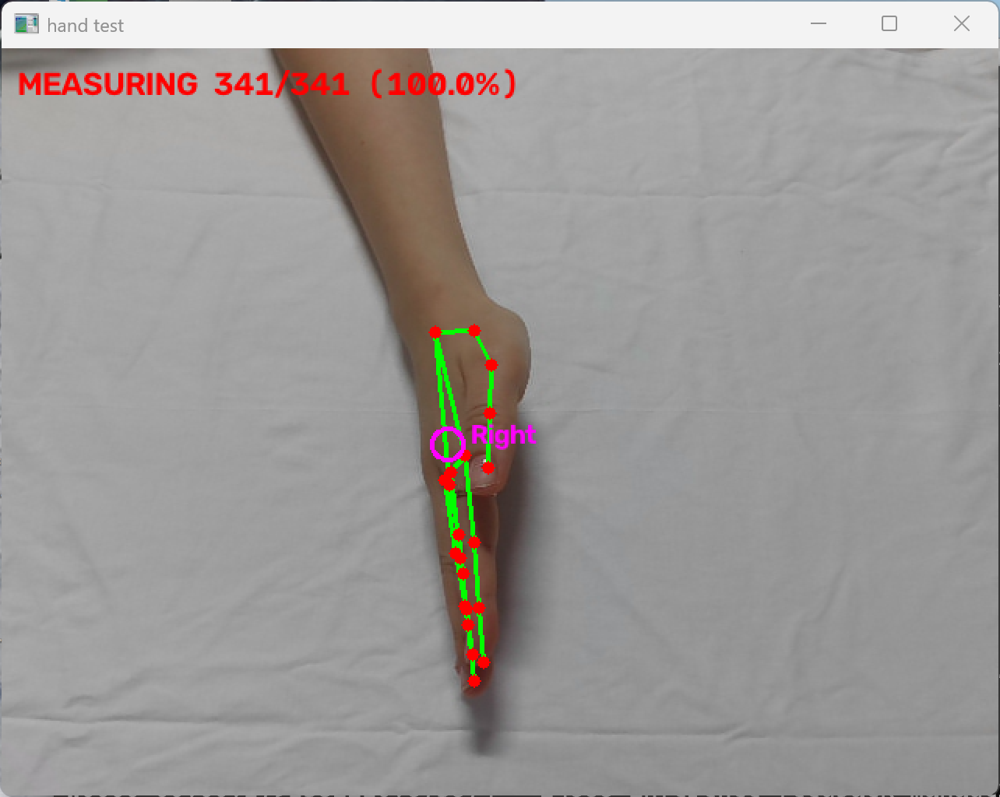
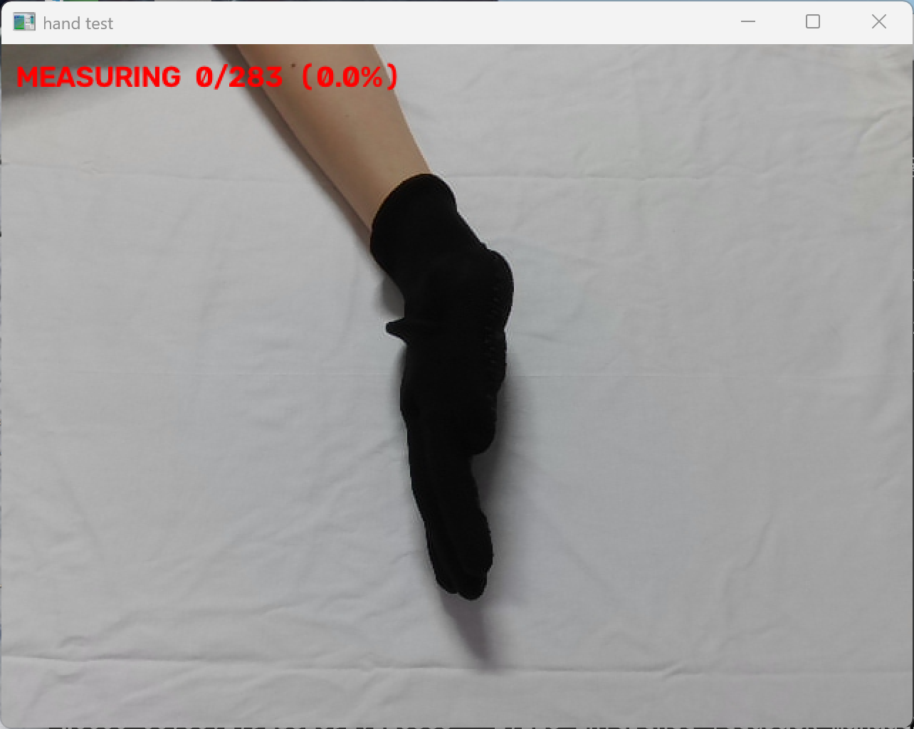
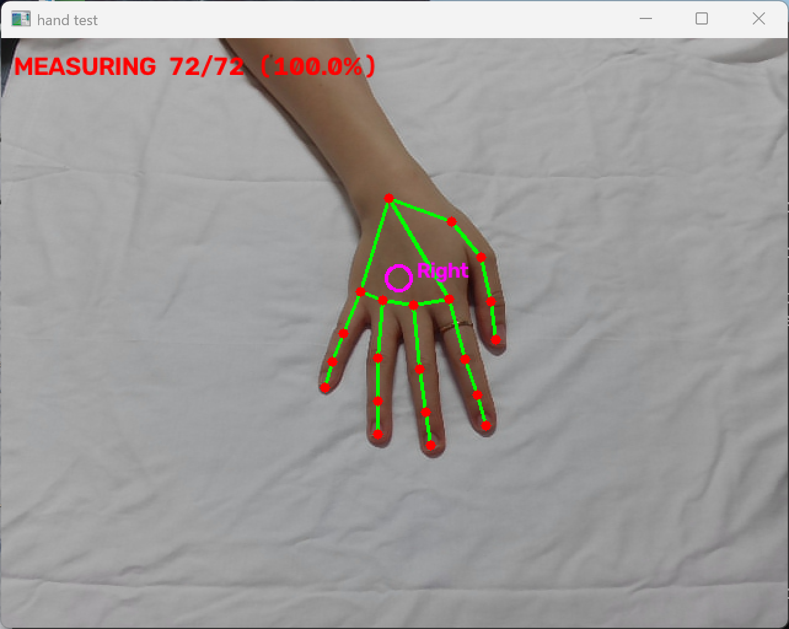
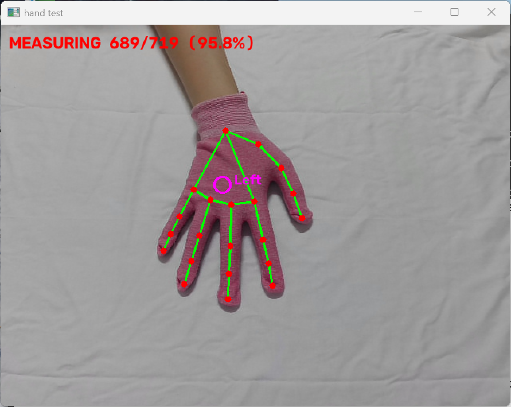
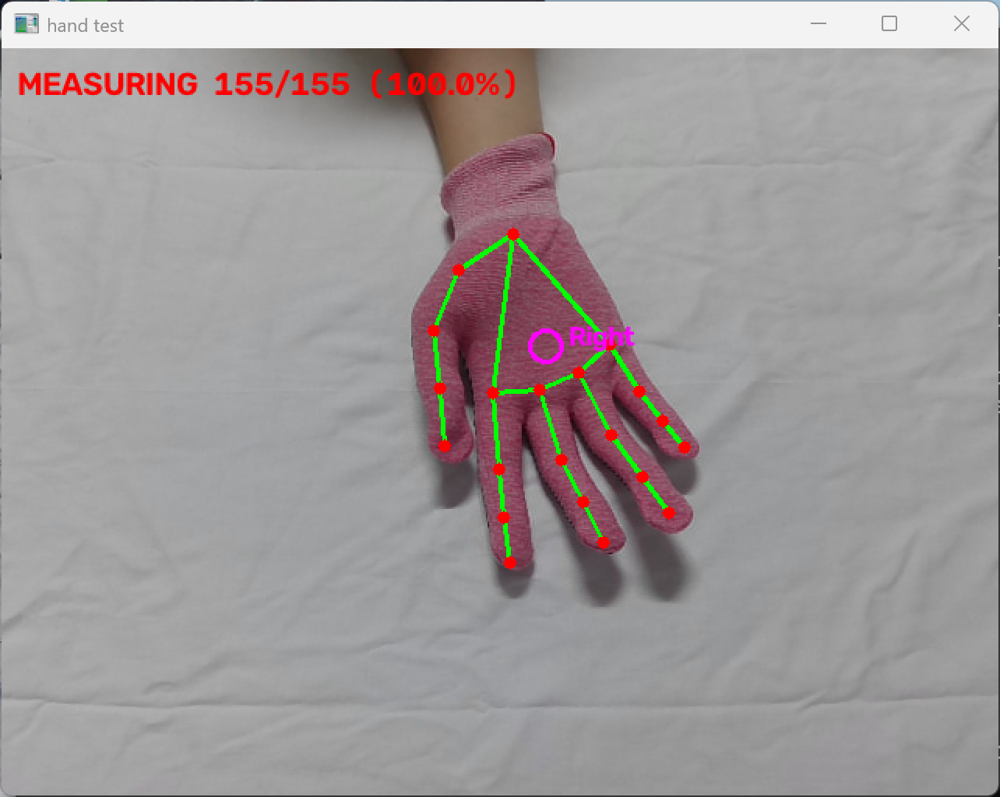
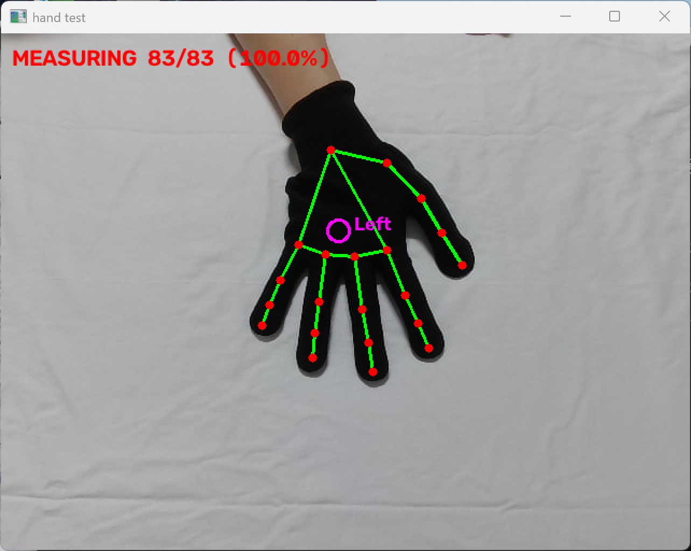

# 장갑 착용 손 인식률 측정

- 측정일: 2026-10-07
- 목적: 장갑 착용 시 MediaPipe 손 인식이 가능한지 확인
- 상태: 노트북 웹캠으로 1차 측정 완료. 모터·PCB 부착 상태는 미측정

---

## 1. 측정 배경

조사 문서(2026-10-02)에서 **장갑 착용 시 인식 실패**를 본 파트의 가장 큰 변수로 기록했다. 의료용 장갑을 다룬 문헌에서 MediaPipe가 키포인트를 전혀 검출하지 못하고 NULL을 반환했다는 보고가 있었기 때문이다.

부품 수령 전에 이 전제가 맞는지 확인하기 위해, 노트북 웹캠과 집에 있는 장갑으로 먼저 측정했다.

## 2. 측정 방법

| 항목 | 내용 |
|---|---|
| 장비 | 노트북 내장 웹캠 |
| 모델 | MediaPipe Hand Landmarker (`hand_landmarker.task`) |
| 측정 대상 | 오른손만 |
| 조건당 시간 | 1차 30-50초, 2차 10-40초 |
| 측정값 | 전체 프레임 중 손이 검출된 프레임의 비율 |

팀 코드가 사용하는 것과 동일한 모델을 사용했다. 다만 **노트북 웹캠과 라즈베리파이 카메라는 화질과 조명 조건이 다르므로, 절대 수치가 아니라 조건 간 비교로 해석해야 한다.**

측정은 두 차례로 나누어 진행했다.

- **1차** — 손등·손바닥·세운 손을 섞어가며 움직인 종합 측정. 실제 사용에 가까운 조건이다.
- **2차** — 자세를 하나로 고정한 측정. 어느 자세가 인식을 떨어뜨리는지 분리하기 위한 것이다.

측정에 사용한 스크립트는 `hand_test.py`이며, 조건별로 `results.csv`에 기록된다.

## 3. 측정 결과

### 3-1. 1차 — 종합 (자세 혼합)

손등·손바닥·세운 손을 섞어가며 움직인 조건이다.

| 조건 | 전체 프레임 | 검출 프레임 | 인식률(%) | 측정 시간(초) | FPS |
|---|---:|---:|---:|---:|---:|
| 맨손 | 966 | 963 | 99.7 | 54.1 | 17.9 |
| 맨손 2 | 369 | 369 | 100.0 | 21.1 | 17.5 |
| 분홍 장갑 | 767 | 722 | 94.1 | 44.1 | 17.4 |
| 분홍 장갑 2 | 565 | 555 | 98.2 | 33.2 | 17.0 |
| 흰색 장갑 | 633 | 609 | 96.2 | 36.2 | 17.5 |
| 검정 반장갑 | 676 | 660 | 97.6 | 38.9 | 17.4 |
| 검정 장갑 | 845 | 761 | 90.1 | 47.3 | 17.9 |
| 검정 장갑 2 | 552 | 471 | 85.3 | 31.1 | 17.8 |
| 파랑 장갑 | 686 | 445 | **64.9** | 35.4 | 19.4 |

첫 번째 맨손 측정(99.7%)은 손을 억지로 세워 인식이 끊기도록 유도한 구간을 포함한다. 일반적인 사용에서는 맨손 2(100%)에 가깝다.

**인식률 순위**

```
분홍 ≈ 흰색 > 검정 반장갑 > 검정 > 파랑
```

### 3-2. 2차 — 자세별 분리

자세를 하나로 고정하고 측정했다.

| 조건 | 손등(%) | 손바닥(%) | 세운 손(%) |
|---|---:|---:|---:|
| 맨손 | 100.0 | 100.0 | **99.6** |
| 분홍 장갑 | 100.0 | 100.0 | **32.8** |
| 흰색 장갑 | — | — | **36.2** |
| 검정 장갑 | 100.0 | 100.0 | **8.4** |

원본 수치는 다음과 같다.

| 조건 | 전체 프레임 | 검출 프레임 | 인식률(%) | 측정 시간(초) |
|---|---:|---:|---:|---:|
| 맨손 손등 | 165 | 165 | 100.0 | 9.3 |
| 맨손 손바닥 | 772 | 702 | 100.0 | 39.7 |
| 맨손 세워서 | 276 | 275 | 99.6 | 16.3 |
| 분홍 손등 | 221 | 221 | 100.0 | 13.1 |
| 분홍 손바닥 | 169 | 169 | 100.0 | 9.8 |
| 분홍 세워서 | 399 | 131 | 32.8 | 17.6 |
| 흰색 세워서 | 293 | 106 | 36.2 | 13.8 |
| 검정 손등 | 162 | 162 | 100.0 | 9.5 |
| 검정 손바닥 | 175 | 175 | 100.0 | 10.7 |
| 검정 세워서 | 359 | 30 | 8.4 | 14.8 |
| 검정 세워서 (재측정) | 283 | 0 | **0.0** | — |

**결과가 명확히 갈린다.**

- **손등과 손바닥은 장갑 색상과 무관하게 모두 100%**다. 손 앞뒤는 인식에 영향을 주지 않는다.
- **세운 손에서만 무너진다.** 맨손은 99.6%를 유지하지만 장갑은 8~36%로 떨어진다.
- 세운 손 조건에서 색상 차이가 가장 크게 나타난다. 분홍·흰색이 30%대, 검정이 8.4%다. 같은 조건을 다시 측정했을 때는 **283프레임 중 0프레임**으로 완전히 실패했다(8-2 참조). 검정 장갑의 세운 손은 측정마다 편차가 크며, 사실상 동작하지 않는 것으로 본다.

1차에서 색상별로 차이가 났던 것은 **세운 손 구간이 섞여 있었기 때문**으로 보인다.

## 4. 관찰 내용

수치만으로는 드러나지 않는 차이가 있었다.

### 4-1. 조사 문서의 전제와 다른 결과

문헌에서는 장갑 착용 시 **검출이 전혀 되지 않는다**고 보고했으나, 본 측정에서는 색상에 따라 **64.9~98.2%**가 나왔다. 가장 잘 되는 조건은 맨손과 큰 차이가 없다.

차이의 원인으로 다음을 추정한다. **확인된 근거는 없다.**

- 문헌 사례는 의료용 장갑이다. 광택이 있고 피부에 밀착되어 손 윤곽의 단서가 적다.
- 본 측정은 모두 면 재질이다. 질감과 그림자가 있어 손 모양이 비교적 드러난다.

### 4-2. 색상에 따른 차이가 크다

**분홍과 흰색이 가장 잘 인식되고, 검정과 파랑이 떨어진다.** 특히 파랑은 64.9%로 사용이 어려운 수준이다.

밝은 색이 유리한 것으로 보이나, 색상 자체의 영향인지 명도의 영향인지는 구분하지 못했다.

### 4-3. 움직임 속도가 공통 변수다

맨손에서도 빠르게 움직이면 인식률이 떨어진다. 다만 **장갑은 그 기준이 더 낮다.**

| 조건 | 끊기기 시작하는 속도 |
|---|---|
| 맨손 | 상당히 빠르게 흔들어야 끊김 |
| 분홍·흰색 | 아주 빠르지 않으면 유지됨 |
| 검정·파랑 | 조금만 빠르게 움직여도 바로 끊김 |

맨손에서도 같은 현상이 나타나므로 **장갑만의 문제가 아니다.** 다만 장갑이 그 한계를 낮춘다.

### 4-4. 세운 손이 유일한 실패 조건이다

2차 측정에서 가장 뚜렷하게 나타난 결과다.

| | 맨손 | 분홍 | 흰색 | 검정 |
|---|---:|---:|---:|---:|
| 손등 | 100.0 | 100.0 | — | 100.0 |
| 손바닥 | 100.0 | 100.0 | — | 100.0 |
| **세운 손** | **99.6** | **32.8** | **36.2** | **8.4** |

**손등과 손바닥은 모두 100%**로, 손 앞뒤는 인식에 전혀 영향을 주지 않는다. 장갑 색상도 무관하다.

반면 **세운 손에서는 맨손만 유지되고 장갑은 모두 무너진다.** 맨손 99.6% 대 검정 장갑 8.4%로 차이가 극단적이다.

조사 문서에서 탑뷰 환경의 위험으로 지적한 내용이 그대로 확인되었다. 손을 세우면 위에서 볼 때 손이 납작해 보여 윤곽 단서가 줄어드는데, 장갑이 그 단서를 더 지우는 것으로 보인다.

관찰에서도 일치했다. 분홍은 의도적으로 방해하지 않는 한 어느 정도 유지되었고, 검정과 파랑은 손을 세우자마자 끊겼다.

측정 화면에서도 차이가 뚜렷하다.

| 맨손 세운 손 | 검정 장갑 세운 손 |
|---|---|
|  |  |
| 341/341 (100.0%) | **0/283 (0.0%)** |

같은 자세인데 맨손은 전 프레임에서 관절이 검출되었고, 검정 장갑은 **283프레임 동안 한 번도 검출되지 않았다.** 장갑이 윤곽 단서를 지우는 정도가 이 조건에서 극대화된다.

### 4-5. 손을 짚는 동작에서의 차이

물건을 짚는 동작을 할 때 **검정과 파랑은 끊겼다가 다시 잡히는** 반면, **분홍과 흰색은 끊김 없이 유지**되었다.

실제 사용에서 손을 뻗어 물건을 집는 동작이 핵심이므로, 이 차이는 중요하다.

### 4-6. 손을 뒤집을 때의 복귀 시간

검정과 파랑은 손을 뒤집은 뒤 **다시 인식하기까지 시간이 걸렸다.** 파랑이 더 심했으며, 움직이는 중에도 자주 끊기고 재인식까지의 간격이 가장 길었다.

본 시스템은 손등·손바닥 전환 시 진동 방향을 반전시켜야 하므로, 뒤집은 직후 인식이 끊기면 안내가 멈춘다.

### 4-7. 좌우 손 판정이 불안정하다

**장갑을 끼고 손을 완전히 편 상태에서는 왼손·오른손 판정이 왔다 갔다 한다.** 손을 살짝 구부리면 오른손으로 제대로 판정한다.

맨손에서는 이 문제가 없었다.

측정 화면에서도 확인된다. 아래 세 장은 모두 **오른손**을 촬영한 것이다.

| 조건 | 손가락 상태 | 판정 |
|---|---|---|
| 맨손 손등 | 약간 구부림 | Right (정상) |
| 맨손 세운 손 | — | Right (정상) |
| 분홍 장갑 손등 | 완전히 폄 | **Left (오판)** |
| 검정 장갑 손등 | 완전히 폄 | **Left (오판)** |
| 분홍 장갑 손바닥 | 약간 구부림 | Right (정상) |

**장갑을 끼고 손가락을 완전히 폈을 때만 오판이 발생했다.** 색상과 무관하게 분홍·검정 모두에서 나타났다.

조사 문서 2-6에 기록한 handedness 반전 문제와는 **별개의 현상**이다. 설정이 뒤집힌 것이 아니라 판정 자체가 흔들리는 것이다.

**시스템에 미치는 영향**

팀 설정은 오른손만 추적하도록 되어 있다. 판정이 왼손으로 뒤집히면 **그 프레임의 손을 버리게 되어 안내가 끊긴다.** 본 측정은 `Any` 설정으로 진행해 검출률에는 영향이 없었으나, 실제 운영 설정에서는 인식률이 더 낮게 나올 수 있다.

대응 방안은 다음과 같다.

- 설정을 `Any`로 두고 화면에 손이 하나만 들어오도록 환경을 제한한다. 팀 문서에는 `Any`가 후보 손이 한 개일 때만 허용되며 두 손이 잡히면 안내를 중단한다고 기록되어 있다.
- 좌우 판정을 여러 프레임에 걸쳐 다수결로 결정한다.
- 손 자세를 제한한다. 다만 사용자에게 손가락을 구부리라고 요구하는 것은 현실적이지 않다.

어느 쪽을 택할지는 실제 설치 조건에서 재측정 후 정한다.

### 4-8. 표면 무늬가 인식을 방해한다

**장갑 바닥면의 도트 무늬를 제거하자 인식이 개선되었다.** 미끄럼 방지용 고무 돌기가 손 윤곽 인식을 방해한 것으로 보인다.

조사한 문헌에서 다루지 않은 조건이다. **장갑 제작 시 표면에 돌기나 무늬가 없도록 해야 한다.**

### 4-9. 반장갑이 유리하다

손가락 끝이 노출된 검정 반장갑을 추가로 측정했다. **같은 검정색인데도 97.6%**로, 검정 장갑(85~90%)보다 크게 높았다.

- 빠른 움직임에서 끊기는 정도는 분홍과 비슷
- 손을 세웠을 때는 분홍보다 낮지만, 검정·파랑보다는 훨씬 나음

조사 문서에서 노출 구조의 효과는 **근거가 없어 판단을 보류**했던 항목이다. 이번 측정으로 **같은 색상 조건에서 노출이 인식에 유리하다는 근거가 생겼다.**

---

## 5. 설계에 반영할 사항

### 5-1. 장갑 색상

**밝은 색으로 제작한다.** 분홍·흰색이 검정·파랑보다 모든 항목에서 우위였다.

**파랑은 사용하지 않는다.** 64.9%로 실용 수준에 미치지 못한다.

### 5-2. 장갑 표면

**돌기나 무늬가 없는 매끈한 면 재질로 제작한다.** 4-8에서 확인했다.

### 5-3. 노출 구조 재검토

조사 문서에서는 노출 구조를 **근거 부족과 비가역성**을 이유로 1차 시제품에서 제외했다. 그러나 4-9의 결과를 보면 **효과가 있을 가능성이 있다.**

다만 모터가 손가락에 부착되므로 노출 범위가 제한된다. **장갑 설계 단계에서 모터 위치와 함께 검토할 필요가 있다.**

### 5-4. 세운 손 구간의 처리

**손등·손바닥은 문제가 없으므로 뒤집힘 자체는 인식에 지장을 주지 않는다.** 뒤집힘 판별은 예정대로 MPU-6050이 담당하고, 카메라는 위치만 산출하면 된다.

문제는 **세운 손 구간**이다. 물건을 집기 위해 손을 기울이는 동작에서 발생할 수 있다. 다음을 검토한다.

- 조사 문서에 정한 **인식 1초 실패 시 마지막 안내 유지** 규칙이 이 구간을 메우는 역할을 한다. 세운 손 구간이 짧다면 안내가 끊기지 않는다.
- 세운 손이 얼마나 오래 유지되는지는 실제 동작을 측정해야 한다.
- 밝은 색 장갑이 이 구간에서도 유리하므로, 색상 선택의 근거가 하나 더 추가된다.

### 5-5. 파인튜닝(C안)의 필요성 재평가

조사 문서에서 **MC-hands-1M 데이터셋으로 장갑 착용 손을 추가 학습하는 방안**을 C안으로 두었다. 본 측정 결과를 반영해 다시 검토한다.

**색상 문제에는 효과가 있을 것으로 보인다.** 원인이 명확하기 때문이다. 모델이 피부색을 주요 단서로 손을 찾는데 장갑이 그 단서를 가리는 구조이므로, 장갑 착용 이미지를 학습시키면 개선될 여지가 있다. 검정이 분홍보다 떨어진 것도 피부색에서 더 멀기 때문으로 추정된다.

**다만 지금 적용할 근거는 약하다.**

| 자세 | 밝은 장갑 | 검정 장갑 | 학습으로 개선할 여지 |
|---|---:|---:|---|
| 손등·손바닥 | 100.0% | 100.0% | 없음. 이미 상한 |
| 세운 손 | 32~36% | 8.4% | 불확실 |

일상 자세에서는 색상과 무관하게 이미 100%다. 학습으로 올릴 수 있는 것은 세운 손 구간뿐인데, **이는 색 문제가 아니라 형태 문제다.** 위에서 보면 손이 납작해져 윤곽 정보 자체가 줄어드는 조건이며, 맨손에서도 쉬운 조건은 아니다.

MC-hands-1M은 야외 환경의 합성 이미지로 구성되어 있다. **탑뷰에서 손을 세운 장면이 얼마나 포함되어 있는지 확인되지 않았으며**, 해당 조건의 데이터가 부족하면 학습해도 이 구간은 개선되지 않는다.

**따라서 다음 순서로 판단한다.**

1. 밝은 색·무늬 없는 장갑으로 제작한다. 비용이 들지 않고 효과가 확인되었다.
2. 모터와 PCB를 부착한 상태로 재측정한다.
3. 2단계에서 인식률이 크게 떨어지면 그때 학습을 검토한다.

2단계가 중요한 이유가 있다. 모터와 PCB 부착은 **색의 문제가 아니라 손 위에 이물질이 올라가는 조건**이므로 본 측정과 성격이 다르다. 거기서 떨어진다면 색상 조정으로는 해결되지 않으며 학습이 필요할 수 있다.

다만 그 경우에도 **MC-hands-1M이 적합한지는 별도 확인이 필요하다.** 해당 데이터셋의 장갑에도 부착물이 없기 때문이다.

### 5-6. 검출기 보강(B안)의 필요성 재평가

조사 문서는 장갑에서 검출이 실패한다는 전제로 **B안(YOLO 검출기로 손 영역을 먼저 찾아 MediaPipe에 전달)을 기본안**으로 했다.

본 측정 결과 **손등·손바닥 조건에서는 색상과 무관하게 100%**가 나왔고, 자세를 섞은 종합 측정에서도 밝은 색 장갑은 90% 후반이었다. **B안 없이도 동작할 가능성이 있다.**

다만 세운 손 구간은 B안으로도 해결되지 않을 수 있다. 손 영역을 먼저 찾아 전달하는 방식인데, 세운 손은 영역을 찾아도 랜드마크 산출이 어려운 조건이기 때문이다. 이 점은 추가 확인이 필요하다.

판단은 다음 조건에서 재측정 후 내린다.

- 모터와 PCB가 부착된 상태
- 라즈베리파이 카메라와 실제 조명 조건
- 탑뷰 고정 설치

---

## 6. 미측정 항목

- **모터·PCB 부착 상태.** 본 측정의 장갑은 부착물이 없다. 부착 후 인식률이 어떻게 변하는지는 시제품이 나와야 확인할 수 있다.
- **라즈베리파이 카메라.** 노트북 웹캠과 화질·시야각이 다르다.
- **탑뷰 고정 설치.** 본 측정은 노트북 카메라 각도에 의존했다.
- **왼손.** 오른손만 측정했다.
- **흰색 장갑의 손등·손바닥.** 세운 손만 측정했다. 다른 장갑이 모두 100%였으므로 같을 것으로 보이나 확인하지 않았다.
- **세운 손의 각도별 차이.** 어느 정도 기울기부터 인식이 무너지는지는 측정하지 않았다.
- **MC-hands-1M의 구성.** 탑뷰 각도와 세운 손 자세가 데이터에 포함되어 있는지 확인하지 못했다. 학습을 진행할 경우 먼저 확인해야 한다.
- **조명 조건.** 실내 조명 한 가지에서만 측정했다.
- **좌우 판정 불안정의 원인.** 4-7의 현상이 장갑 때문인지, 손 모양 때문인지 구분하지 못했다.

---

## 7. 측정 도구

`hand_test.py` — 웹캠으로 인식률을 측정하고 CSV에 기록한다.

```
py hand_test.py --label 조건이름
```

`s` 키로 측정을 시작·중지하며, 결과가 `results.csv`에 누적된다. 조건을 바꿔가며 같은 방식으로 측정했다.

---

## 8. 측정 화면

### 8-1. 손 앞뒤 — 모두 정상 인식

| 맨손 손등 | 분홍 장갑 손등 | 분홍 장갑 손바닥 |
|---|---|---|
|  |  |  |
| 100.0% / Right | 95.8% / **Left (오판)** | 100.0% / Right |



검정 장갑 손등 — 100.0% / **Left (오판)**

**손등과 손바닥 모두 21개 관절이 정상 검출된다.** 장갑 색상도 영향을 주지 않는다. 다만 손가락을 완전히 편 장갑 조건에서는 좌우 판정이 뒤집혔다(4-7 참조).

### 8-2. 세운 손 — 장갑에서 완전히 실패

| 맨손 세운 손 | 검정 장갑 세운 손 |
|---|---|
|  |  |
| **341/341 (100.0%)** | **0/283 (0.0%)** |

같은 자세, 같은 조명, 같은 각도에서 측정했다. 맨손은 전 프레임 검출, 검정 장갑은 **단 한 프레임도 검출되지 않았다.**

이 조건이 본 측정에서 확인된 유일한 실패 지점이다.

### 8-3. 손 기준점

모든 화면의 보라색 원이 **손 기준점**이다. 손목과 손가락 뿌리 관절 다섯 개의 평균이며, 팀 설계 문서에 정의된 지점이다. 물체와의 상대 벡터를 계산할 때 이 점을 사용한다.

---
